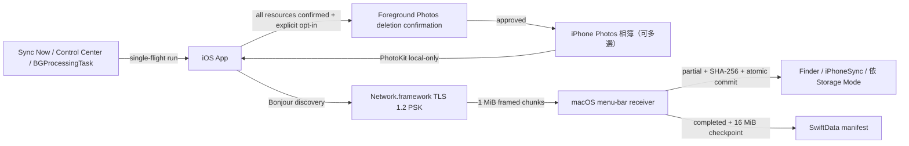

# iPhone Sync

`iPhone Sync` v1.0 — 一套原生 iPhone 與 Mac 的個人媒體備份工具 (personal media backup)，只走同一區域網路 (LAN)，不經雲端。

配對一次之後，iPhone 指定相簿中尚未備份、且已存在本機的完整原始資源 (original resource)，會單向增量傳送到自己的電腦。Optional `Delete After Sync` 預設關閉；只有明確啟用並完成全部資源驗證的 photos 才會進入 foreground deletion confirmation。

- 目錄 (Contents)
    - [1. 這是什麼 (What It Is For)](#1-這是什麼-what-it-is-for)
    - [2. 使用方式 (How to Use)](#2-使用方式-how-to-use)
    - [3. 安裝與設定步驟 (Setup Step by Step)](#3-安裝與設定步驟-setup-step-by-step)
    - [4. 驗證、設定與邊界 (Verification, Settings, Boundaries)](#4-驗證設定與邊界-verification-settings-boundaries)

## 1. 這是什麼 (What It Is For)

`iPhone Sync` 提供兩種對等的接收端：macOS menu-bar receiver（原 MVP）與 Windows 11 desktop receiver（Electron + Node.js port）。iPhone sender 透過 Bonjour 自動看見所有 `_iphonesync._tcp` 服務，由使用者在 iPhone 端挑選要同步到哪台電腦；Mac 與 Windows 共用同一份 wire protocol（`protocolVersion = 1`），iOS App 不需區分平台。

### 解決的問題 (Problem)

| 情境                                     | 既有做法的痛點            | `iPhone Sync`                                  |
| ---------------------------------------- | ------------------------- | ---------------------------------------------- |
| 想把 iPhone 相簿原始檔留在自己的硬碟     | iCloud 需付費且是雲端副本 | LAN 直傳到你選的 Finder 資料夾                 |
| 想保留 RAW、影片、Live Photo、adjustment | AirDrop 逐張手動、易漏    | 依相簿整批增量，只補未備份的                   |
| 想要固定備份而不用每天記得               | 手動流程一定會忘          | opt-in `Automatic Sync`，由 iOS 於背景擇機執行 |
| 備份完成後想釋放 iPhone 空間             | 逐張核對與刪除容易出錯    | opt-in `Delete After Sync`，只處理完整確認資產 |
| 不想把照片交給第三方服務                 | 多數工具需要帳號或雲端    | 無帳號、無伺服器、無 Internet relay            |

### 業務定義 (Business Definition)

- 來源固定為一部 iPhone 上由使用者選取的一個或 多個 Photos 相簿。
- 目的地固定為一部已配對 Mac 上的 Finder folder；實際寫入位置固定在 `<selected-folder>/iPhoneSync/` 之下，版面由 `Storage Mode` 決定。
- 同步只新增；iPhone 刪除不會傳播至 Mac，也不覆寫 Mac 既有的不同內容。
- `Delete After Sync` 預設關閉；未啟用時 App 絕不刪除 Photos assets。啟用後也只刪除每個本機 original resource 都已由 receiver 確認完成的整個 asset。
- 刪除是 Photos library-wide，不是只移出所選相簿；使用 `iCloud Photos` 時也可能同步影響同 Apple Account 的其他裝置。每個 foreground batch 仍由 Photos 顯示 system confirmation。
- 傳輸只使用同一區域網路，不使用 AirDrop、Bluetooth、Internet relay 或雲端服務。
- 備份保留 PhotoKit 提供的原始 resource bytes，包括 RAW、影片、Live Photo components 與 adjustment data。
- 不在 iPhone 本機的 iCloud Photos resource 會被跳過，App 不會自動下載。
- 兩個不同相簿若名稱相同，第一個使用原名，後續穩定使用 `名稱 (2)`、`名稱 (3)`，不會合併。
- Automatic sync 是 opt-in、best-effort；`Sync Now` 永遠是可立即觸發的 fallback。

### Domain Flow



### 影片示範腳本 (Video Demo Transcript)

目標長度 `0:30`，六個鏡頭。`畫面` 為錄影內容，`旁白` 為配音逐字稿；配對與目的地選擇在開拍前完成，只錄操作結果。

| 時間   | 畫面 (Screen)                                                                     | 旁白 (Narration)                                                  |
| ------ | --------------------------------------------------------------------------------- | ----------------------------------------------------------------- |
| `0:00` | Mac menu bar 圖示，Setup 顯示已選好的目的地資料夾                                 | 「把 iPhone 相簿的原始檔，走區域網路備份到自己的 Mac。」          |
| `0:05` | 點 `Pair iPhone`，大字六位數配對碼與兩分鐘倒數                                    | 「Mac 顯示六位數字，這組數字不走網路，只用來確認是這台。」        |
| `0:11` | iPhone 選兩個相簿，按 `Find Mac`，輸入六位數，顯示已配對                          | 「iPhone 挑相簿，輸入數字，配對一次就好。」                       |
| `0:17` | 按 `Sync Now`，進度列跑動；Mac Finder 同時長出 `iPhoneSync/Trip 2026/2026/07/`    | 「按下同步，檔案驗完 SHA-256 才落地，就是一般的 Finder 資料夾。」 |
| `0:24` | 再按一次 `Sync Now`，摘要 `Added 0` / `Already 812`；帶到 `Automatic Sync` toggle | 「重跑只補新的。打開自動同步，之後不用再記得。」                  |
| `0:29` | 回到 Mac menu bar 圖示，淡出                                                      | 「你的照片，你的硬碟。」                                          |

錄影前置檢查 (pre-flight)：Mac 與 iPhone 同一 Wi-Fi、iPhone 已關閉勿擾以外的通知、備份目的地先清空、`Operation Log` 先 clear、Debug 卡片在 Release build 不會出現。

## 2. 使用方式 (How to Use)

### 日常流程 (Daily Flow)

1. Mac 保持登入即可，menu-bar receiver 會自動恢復 destination、配對與 manifest。
2. iPhone 端有四種觸發同步的入口：

| 入口             | 位置                                        | 行為                                                |
| ---------------- | ------------------------------------------- | --------------------------------------------------- |
| `Sync Now`       | iPhone 主畫面 Mac 卡片                      | 立即前景同步，永遠可用的 fallback                   |
| Control widget   | 控制中心自訂項目 `Sync Now`                 | 不開啟 App，透過 `SyncNowIntent` 觸發既有 sync 入口 |
| 1x1 shortcut     | Shortcuts / Siri：`Sync now in iPhone Sync` | 同上，走同一個 `handleIncomingURL` 路徑             |
| `Automatic Sync` | 主畫面 `AUTOMATIC SYNC` 區                  | opt-in 後由 iOS `BGProcessingTask` best-effort 啟動 |

3. 同步中可按 `Cancel`；同一時間只允許一個 run（single-flight）。
4. 完成後 `LAST SYNC` 顯示 `Added` / `Already` / `Not local` / `Failed` 四項摘要。
5. 若明確啟用 `Delete After Sync`，foreground sync 完成後 Photos 會要求確認刪除；background sync 只建立 pending list，回到 App 後按 `Delete N Synced Photos`。

### 檔案落點 (Storage Mode)

Mac Setup 的 `Storage Mode` 決定 `iPhoneSync` 容器內的版面，固定容器本身不可變更：

| 模式                           | 實際路徑                                                 | 適用                   |
| ------------------------------ | -------------------------------------------------------- | ---------------------- |
| `Album / Year / Month`（預設） | `<destination>/iPhoneSync/<album>/<year>/<month>/<file>` | 相簿多、時間跨度長     |
| `Album`                        | `<destination>/iPhoneSync/<album>/<file>`                | 相簿即分類，不需日期層 |
| `Single Folder`                | `<destination>/iPhoneSync/<file>`                        | 之後交給其他工具再分類 |

若 `iPhoneSync` 或相簿資料夾已是安全的真實資料夾，Mac 直接重用並保留全部既有內容；若同名項目是檔案、symlink 或不安全路徑，session 會拒絕並顯示於 Mac `Operation Log`。切換模式不會搬動或刪除既有 committed 檔案。

### Automatic Sync 的真實語意

- Release：最早執行時間為使用者在 `Schedule time` 設定的每日本地時間（預設 local midnight）。
- Debug：另有獨立的 `AUTOMATIC SYNC (DEBUG)` 卡片，最早為提交後 `10 分鐘`，並附前景測試迴圈；Release build 不註冊此迴圈。
- 兩者都只是 `earliestBeginDate`。iOS 不保證準時、不保證固定週期、不保證一定提供 runtime，實際執行可能晚很多。
- App 啟動與 scene 切換會 reconcile 既有 pending request：同一 request 若不晚於目前目標便保留，不重複提交、不把 `Next attempt` 往後推。
- Mac 不可達、系統未啟動 background task 或背景排程不可用時，請直接用 `Sync Now`。

### Delete After Sync 的安全語意

- `Delete After Sync` 是獨立、持久化且預設關閉的 toggle；關閉或按 `Forget` 時會清除 pending deletion IDs。
- 刪除單位是整張 photo / video / Live Photo 對應的 `PHAsset`。每個 PhotoKit resource 都必須在每個已選相簿 session 收到 `committed` 或 `already present`；只要一個 resource 是 `Not local`、failed、cancelled 或尚未完成，整個 asset 都保留。
- Foreground manual / Debug automatic run 完整成功後，App 以一個 PhotoKit change batch 請求刪除，iOS 仍顯示 system confirmation。使用者取消時不刪除，candidate 保留為 pending。
- System-launched background run 無法安全顯示 foreground change confirmation，因此只保存 fully backed-up asset ID / `modificationDate` snapshots。回到 App 後，`AFTER SYNC` card 顯示數量與 `Delete N Synced Photos` button；刪除前版本已改變的 asset 會保留，必須等下一次完整同步。
- Photos deletion 會從整個 library 移除 asset，不是只從所選相簿移除；若使用 `iCloud Photos`，也會影響同 Apple Account 的其他裝置。Receiver 已 committed 的 Finder / Windows files 永遠保留。

完整 contract 見 [Delete After Sync 規格](docs/specs/2026-07-27-delete-after-sync.md)。

### 網路前提 (Network Gate)

iPhone 必須使用 Wi-Fi；Mac 可使用同一 LAN 的 Wi-Fi 或 Ethernet。Manual 與 automatic run 都以「Bonjour 可見 exact paired `receiverID`，且保存的 PSK 能完成 TLS handshake」作為同網路 gate，不比較 SSID 或 IP subnet。Bonjour 若被 guest network、VLAN、VPN 或 router client isolation 阻擋，App 不會繞過網路限制。

### Operation Log

iPhone 主畫面與 Mac Setup 都有 `Operation Log` panel，以 `info`、`success`、`warning`、`error` 顯示 App、設定、Photos、相簿、配對、discovery、scheduler、listener、session、resource 與 sync outcome。兩端各保留本次 process 最新 `500` 筆並同步寫入 Apple Unified Logging；iPhone 可展開全部或清除，Mac 可 `Copy All` 或清除。為避免大型影片洗掉可讀事件，panel 記錄每個 resource lifecycle，不逐一記錄 1 MiB chunk。PSK、六位數 pairing code、cryptographic identity、source binding 與 content hash 不會進入 panel。

## 3. 安裝與設定步驟 (Setup Step by Step)

### 3.1 依賴 (Dependencies)

技術脈絡與版本決策的單一來源為 [CLAUDE.md](CLAUDE.md)。

| 依賴                   | 版本 / 來源                            | 用途                                                    |
| ---------------------- | -------------------------------------- | ------------------------------------------------------- |
| macOS                  | `14.0+`（receiver 部署目標）           | 執行 Mac menu-bar receiver                              |
| iOS                    | `18.0+`（sender 部署目標）             | 執行 iPhone sender 與 Control Center 控制項             |
| Xcode                  | `26.0`（`project.yml` `xcodeVersion`） | 建置兩個 App target                                     |
| Swift                  | `6.0`                                  | `SyncCore` / `MacReceiverKit` 與兩個 App                |
| XcodeGen               | `brew install xcodegen`                | 由 `project.yml` 產生 project、Info.plist、entitlements |
| jq                     | `brew install jq`                      | `scripts/verify.sh` 解析 simulator 清單                 |
| plutil                 | macOS 內建                             | 驗證產生的 plist 與挑選實體裝置                         |
| xcrun devicectl        | Xcode 內建                             | 安裝、啟動實體 iPhone 與附掛 console                    |
| Apple Development 簽署 | Apple ID + development team            | 實機安裝、sandbox 授權、launch at login                 |

`project.yml` 是 Xcode target、Info.plist 與 entitlements 的唯一來源；不要直接修改產生後的 `apps/*/Info.plist` 或 `*.entitlements`。權限逐項說明見 [README.permission.md](README.permission.md)。

```bash
brew install xcodegen jq
xcodegen generate
```

產生的 `iPhoneSync.xcodeproj`、Info.plist 與 entitlements 已提交，checkout 後不安裝 XcodeGen 也能直接開啟專案。

### 3.2 Mac 端設定 (Receiver)

```bash
./scripts/run_server.sh
```

此腳本重新產生 project、以 `Debug` 建置 `iPhoneSyncMac`、停止舊 process，並帶 `--open-setup` 啟動 App。可用旗標：`--build-only`（只建置）、`--no-build`（只啟動既有建置）。

或在 Xcode 開啟 `iPhoneSync.xcodeproj`，為 `iPhoneSyncMac` 選擇開發團隊後執行。

1. menu bar 出現 `iPhone Sync` 圖示，點開選 `Open Setup`。
2. 按 `Choose Destination`，第一次會預設開在 `Downloads`；選定後 sandbox 以 security-scoped bookmark 保存權限。
3. 選擇 `Storage Mode`。
4. 按 `Pair iPhone`，畫面顯示六位數配對碼與兩分鐘倒數。
5. macOS 15+ 首次會出現 Local Network 授權提示，必須允許。

若 menu bar 空間不足看不到圖示：騰出一個位置，按住 `Command` 把 `iPhone Sync` 拖近右側，位置會由 autosave name 保存。

### 3.3 iPhone 端設定 (Sender)

```bash
./scripts/run_iphone.sh                        # Debug 建置、安裝、啟動
./scripts/run_iphone.sh --profile=production   # Release
./scripts/run_iphone.sh --build-only           # 只產生已簽署 archive
```

腳本會自動解析 Apple Development team、以 `xcrun devicectl` 挑選唯一一台已配對且連線的實體 iPhone。多台裝置時設 `DEVICE_UDID`；多組團隊時設 `DEVELOPMENT_TEAM`。前提是 iPhone 已解鎖、已信任這台 Mac 並開啟 `Developer Mode`。

1. 首次啟動授予 `Photos Full Access`（`.limited` 不被接受）。
2. 按 `Choose Albums` 選一個或多個相簿。
3. 按 `Find Mac`，首次會出現 Local Network 授權提示，必須允許。
4. 從候選清單選擇 Mac，輸入 Mac 顯示的六位數配對碼。
5. 按 `Sync Now` 完成第一次同步。
6. 需要背景同步再打開 `Automatic Sync` 並設定 `Schedule time`；需要一鍵觸發則到控制中心加入 `Sync Now` 控制項。
7. 只有確定要在完整備份後刪除來源時才打開 `Delete After Sync`；閱讀 library-wide / iCloud Photos 警告並確認。保持關閉時不會刪除任何 photos。

### 3.4 除錯 (Debugging)

Mac receiver：

```bash
./scripts/run_server.sh --build-only                      # 只驗證編譯
log stream --predicate 'subsystem CONTAINS "iphonesync"'  # Unified Logging 即時串流
```

- Setup 的 `Operation Log` 是第一現場，可 `Copy All` 直接貼出。
- 完整事件（含 listener retry、wake/path reconcile）同時進入 Apple Unified Logging。
- destination bookmark 失效時 App 會要求重新選擇資料夾，不會靜默失敗。
- `Forget iPhone` 只刪 Keychain trust，`Reset Source` 只建立新的 source binding，兩者都不刪 Finder 檔案。

iPhone sender：

```bash
./scripts/run_iphone.sh --console   # 重啟 App 並附掛 process console
```

- 主畫面 `Operation Log` 展開後可看到 App、Photos、相簿、配對、discovery、scheduler、run、session 與每個 resource 的 levelled 事件。
- Debug build 才有 `AUTOMATIC SYNC (DEBUG)` 卡片與 10 分鐘前景測試迴圈，用來驗證排程路徑而不必等到半夜。
- `Delete After Sync` 的 pending count 與每次 request / success / cancel / skip 都記在 `Operation Log`；log 只記數量，不包含 Photos asset identifiers。
- 背景排程被系統拒絕時，`Background App Refresh` 文字與 `Operation Log` 會標示原因。
- Control Center 觸發若無反應，先確認已配對且 prerequisites 齊全；不符合時 `Operation Log` 會記一筆 `Widget trigger ignored`。

常見狀況：

| 症狀                  | 檢查點                                                                                                |
| --------------------- | ----------------------------------------------------------------------------------------------------- |
| `Find Mac` 找不到 Mac | 兩端同一 Wi-Fi、Mac 配對視窗仍在兩分鐘內、非 guest network / VLAN / VPN、router 未開 client isolation |
| 配對碼輸入失敗        | 碼已逾時（120 秒）或嘗試次數用盡，回 Mac 重新 `Pair iPhone`                                           |
| 大量 `Not local`      | 該資源只在 iCloud，App 固定 `isNetworkAccessAllowed = false`，需先在 Photos 下載到本機                |
| Automatic 從未執行    | `earliestBeginDate` 不是保證；先用 Debug 卡片驗證路徑，再用 `Sync Now` 作為 fallback                  |
| 已同步但尚未刪除      | Background run 只建立 pending list；回到 App，在 `AFTER SYNC` 按 `Delete N Synced Photos` 並確認     |
| Mac 寫入被拒          | 目的地同名項目是檔案或 symlink，`Operation Log` 會標示；換一個 destination 或移除該項目               |

## 4. 驗證、設定與邊界 (Verification, Settings, Boundaries)

### 驗證 (Verification)

```bash
bash scripts/verify.sh                          # canonical 全量驗證（含 SyncCore.Windows 49 tests + 兩 build + source invariants）
swift test --package-path packages/SyncCore     # 只跑 Swift package tests
```

驗證入口會執行 Swift package tests、重新產生 Xcode project、建置 macOS、iOS Simulator 與 `Release` generic iOS device targets、檢查 plist / entitlements / local-only source invariants，以及 tracked、staged、untracked whitespace checks。`Release` device build 會實際編譯 `#if DEBUG` 之外的 production cadence 分支。建置使用 `CODE_SIGNING_ALLOWED=NO`。

Windows 11 receiver 端會額外跑 `scripts/verify_windows.sh`：49 個 vitest、SyncCore.Windows 與 apps/windows 兩個 TypeScript build、source-string invariants（HKDF labels、`IPS1` magic、`iPhoneSync` 容器、`TLS_PSK_WITH_AES_128_GCM_SHA256`、`powerMonitor` 等）。`npm run dist`（NSIS + portable）只在 Windows MSYS shell 觸發。

最近一次 canonical 通過紀錄為 `54` 個 Swift package tests、`41` 個 iOS unit tests、`49` 個 Windows vitest、三個 Apple builds 與兩個 TypeScript builds。Mac half-open deadline 有 package behavior test；其餘 receiver recovery、`BGProcessingTask` lifecycle 與 PhotoKit deletion 主要是編譯 / source-invariant / injected-service tests，不等同完整行為測試或實機驗收。

### Windows 11 Release (GitHub Actions)

`.github/workflows/release-windows.yml` 自動在 `windows-latest` 跑：

1. `npm ci` + `npm run build`（SyncCore.Windows 與 apps/windows）
2. `npm run dist`（electron-builder 產 NSIS installer + portable .exe）
3. 上傳 artifact `iPhoneSync-Windows-x64` 與自動發佈到 GitHub Release

Trigger：

- `v*` tag push → 自動建立 Public Release
- `workflow_dispatch` → Manual 建立 Draft Release

本地預覽（macOS 開發機驗證）：

```bash
bash scripts/verify_windows.sh      # 49 tests + 2 builds + invariants pass
```

### 持久化設定 (Persistent Settings)

App 設定依資料敏感度使用 Apple 原生持久層，不集中到單一可讀檔案：

| Data                                                                                       | Persistent Store                                                                 |
| ------------------------------------------------------------------------------------------ | -------------------------------------------------------------------------------- |
| automatic sync enablement、last attempt/success/outcome、next eligible time、schedule time | iOS sandbox `UserDefaults`，由 `IOSAutomaticSyncStore` 管理                      |
| delete-after-sync enablement、pending Photos asset ID / `modificationDate` snapshots       | iOS sandbox `UserDefaults`，由 `IOSDeleteAfterSyncStore` 管理                    |
| receiver ID、source binding、storage mode、launch-at-login intent                          | sandbox `UserDefaults`，由 `MacSettingsStore` 管理                               |
| Finder destination permission                                                              | security-scoped bookmark in sandbox preferences                                  |
| paired iPhone PSK、opaque identity                                                         | login Keychain                                                                   |
| album mappings、完成狀態、續傳 checkpoint                                                  | SwiftData in App container `Application Support`                                 |
| 開機自動執行                                                                               | `SMAppService.mainApp` login item registration                                   |
| Setup window size/position、menu-bar item position                                         | AppKit autosave                                                                  |
| iOS / macOS operation timeline                                                             | 各 App process 的 bounded in-memory buffer（最新 500 筆）+ Apple Unified Logging |

`Automatic Sync` 預設關閉；關閉時取消 pending request 與 active automatic run，不刪除 pairing、相簿選擇、partial 或 manifest。`Delete After Sync` 也預設關閉；關閉時清除 pending deletion IDs 且不呼叫 PhotoKit deletion，receiver files 不受影響。`Launch at Login` 首次預設啟用，使用者關閉後保存該選擇。六位數 pairing code、active connection、active deletion request 與 panel 中的 operation timeline 是 transient runtime state，不跨重啟保存。

### 安全與資料邊界 (Security Boundaries)

- 初次配對使用 ephemeral Curve25519 key agreement；六位數僅作 short authentication string (SAS)，不透過網路傳送，也不是加密金鑰。
- 配對成功後導出的 256-bit secret 與 opaque identity 存入 Keychain，正常同步使用 TLS 1.2 static PSK (`TLS_PSK_WITH_AES_128_GCM_SHA256`)。
- iPhone discovery 與連線固定 `includePeerToPeer = false`，不走 Bluetooth / AWDL fallback。
- Automatic run 每次重新 discovery 與 authentication，不保存 IP、port、`NWEndpoint`，也不維持常駐 socket 或 heartbeat。
- PhotoKit request 固定 `isNetworkAccessAllowed = false`，不因同步而觸發 iCloud 下載。
- Optional deletion 只在 asset 的所有 local resources 已由 receiver authoritative manifest 確認後提出；toggle off、not-local、partial、cancel 或 failed asset 永遠保留。Photos system confirmation 被拒絕時也不刪除。
- Receiver 先驗證 frame、offset、expected size 與 SHA-256，完成後才以不覆寫方式 atomic commit；同一 resource 第二次 integrity mismatch 會終止 session。
- Mac 不要求 Full Disk Access，只寫入使用者以 `NSOpenPanel` 選取的 destination。

### 專案狀態 (Project Status)

MVP、多相簿同步、`Automatic Sync` scheduler / single-flight runtime、default-off `Delete After Sync`、Mac listener recovery、三種 storage mode、Control Center / Shortcuts 觸發、兩端 `Operation Log` panels、typed persistent settings 與 UI design tokens 已完成，並通過 canonical `bash scripts/verify.sh`。

尚未完成、以 [README.todo](README.todo) 為準：signed 實機的 Photos deletion confirmation / iCloud propagation、background launch / expiration 模擬、overnight 自然排程觀察、完整 LAN failure matrix，以及簽署、公證 (notarization) 與發佈方式的決定。

### 文件索引 (Documentation Index)

| 文件                                                                                                         | 內容                                     |
| ------------------------------------------------------------------------------------------------------------ | ---------------------------------------- |
| [CLAUDE.md](CLAUDE.md)                                                                                       | 技術脈絡、架構、依賴方向、已核准技術選擇 |
| [README.permission.md](README.permission.md)                                                                 | iOS / macOS 權限與能力逐項說明           |
| [README.todo](README.todo)                                                                                   | 待辦與實機驗收清單                       |
| [apps/ios/README.md](apps/ios/README.md)                                                                     | iPhone sender 的 flow 與邊界             |
| [apps/macos/README.md](apps/macos/README.md)                                                                 | Mac receiver 的 flow 與邊界              |
| [apps/windows/README.md](apps/windows/README.md)                                                             | Windows 11 receiver 的 flow 與邊界       |
| [packages/SyncCore/README.md](packages/SyncCore/README.md)                                                   | 傳輸協定、crypto、manifest 與 writer     |
| [docs/specs/2026-07-19-local-album-sync-design.md](docs/specs/2026-07-19-local-album-sync-design.md)         | 原始 MVP 設計                            |
| [docs/specs/2026-07-23-automatic-lan-sync.md](docs/specs/2026-07-23-automatic-lan-sync.md)                   | Automatic LAN sync 規格                  |
| [docs/specs/2026-07-24-ui-redesign.md](docs/specs/2026-07-24-ui-redesign.md)                                 | UI design tokens 與版面規格              |
| [docs/specs/2026-07-25-windows-11-desktop-receiver.md](docs/specs/2026-07-25-windows-11-desktop-receiver.md) | Windows 11 desktop receiver 設計         |
| [docs/specs/2026-07-27-delete-after-sync.md](docs/specs/2026-07-27-delete-after-sync.md)                     | 同步後 optional Photos deletion contract |
| [plans/2026-07-23-operation-log-panels.md](plans/2026-07-23-operation-log-panels.md)                         | Operation timeline contract              |
| [plans/2026-07-25-windows-11-desktop-receiver.md](plans/2026-07-25-windows-11-desktop-receiver.md)           | Windows 11 port 實作計畫                 |
