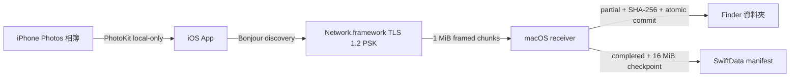

# iPhone Sync

`iPhone Sync` 是一套原生 iPhone 與 Mac 個人媒體備份工具。使用者在 iPhone 前景手動觸發同步，將一個指定 Photos 相簿中尚未備份、且已存在 iPhone 本機的完整原始資源，單向增量傳送至已配對 Mac 的 Finder 資料夾。

## 業務定義 (Business Definition)

- 來源固定為一部 iPhone 上的一個 Photos 相簿。
- 目的地固定為一部已配對 Mac 上的 Finder 資料夾。
- 同步只新增；iPhone 刪除不會傳播至 Mac，也不覆寫 Mac 的既有不同內容。
- 傳輸只使用同一區域網路，不使用 AirDrop、Bluetooth、Internet relay 或雲端服務。
- 備份保留 PhotoKit 提供的原始 resource bytes，包括 RAW、影片、Live Photo components 與 adjustment data。
- 不在 iPhone 本機的 iCloud Photos resource 會被跳過，App 不會自動下載。

## Domain Flow



## 使用方式

1. 在 Mac App 選擇目的資料夾，再開啟兩分鐘配對視窗。
2. 在 iPhone 授予 Photos Full Access、選擇一個相簿，再按 `Find Mac`。
3. 選擇同一 LAN 上的 Mac，輸入 Mac 顯示的六位數配對碼。
4. 在 iPhone 按下 `Sync Now`，同步期間保持 App 在前景。
5. Mac 驗證每個 resource 後才寫入 Finder；再次同步只傳新增或未完成內容。

iPhone 必須使用 Wi-Fi；Mac 可使用同一 LAN 的 Wi-Fi 或 Ethernet。Bonjour 若被 guest network、VLAN、VPN 或 router client isolation 阻擋，App 不會繞過網路限制。

## 建置與執行

需求：Xcode 26、Swift 6 與 XcodeGen。

```bash
xcodegen generate
open iPhoneSync.xcodeproj
```

在 Xcode 為 `iPhoneSyncMac` 與 `iPhoneSyncIOS` 選擇同一開發團隊後：

1. 先在 Mac 執行 `iPhoneSyncMac`，從選單列開啟 `Open Setup`。
2. 選擇 Finder destination 並按 `Pair iPhone`。
3. 在實體 iPhone 執行 `iPhoneSyncIOS`，完成授權、相簿選擇與配對。

`project.yml` 是 Xcode target、Info.plist 與 entitlements 設定的唯一來源；變更後必須重新執行 `xcodegen generate`。產生的 `iPhoneSync.xcodeproj`、Info.plist 與 entitlements 已提交，checkout 後不必先安裝 XcodeGen 即可直接開啟。

## 驗證

```bash
bash scripts/verify.sh
```

驗證入口會執行 Swift package tests、重新產生 Xcode project、建置 macOS、iOS Simulator 與 generic iOS device targets、檢查 plist/entitlements/local-only invariants，以及執行 `git diff --check`。建置使用 `CODE_SIGNING_ALLOWED=NO`，因此不等同實體裝置驗收。

## 安全與資料邊界

- 初次配對使用 ephemeral Curve25519 key agreement；六位數僅作 short authentication string (SAS)，不會透過網路傳送，也不是加密金鑰。
- 配對成功後的 256-bit secret 與 opaque identity 存入 Keychain，正常同步使用 TLS 1.2 static PSK。
- iPhone discovery 與連線固定 `includePeerToPeer = false`，不走 Bluetooth/AWDL fallback。
- PhotoKit request 固定 `isNetworkAccessAllowed = false`，不因同步而觸發 iCloud 下載。
- Mac 以 security-scoped bookmark 保存 destination 權限；完成狀態與續傳 offset 存於 App container 的 SwiftData manifest。

## 專案狀態

MVP 程式、edge-case tests、兩個原生 App targets 與 canonical verification 已完成。自動驗證涵蓋 unsigned builds；實體 iPhone、真實 Photos library、簽署與網路故障情境仍列於 [README.todo](README.todo)，不得將 unsigned build 視為實機成功。

完整設計見 [local album sync design](docs/specs/2026-07-19-local-album-sync-design.md)，技術結構見 [CLAUDE.md](CLAUDE.md)。
