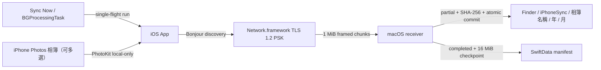

# iPhone Sync

`iPhone Sync` 是一套原生 iPhone 與 Mac 個人媒體備份工具。完成一次 pairing 後，使用者可按 `Sync Now` 立即同步，或 opt in `Automatic Sync`，讓 iOS 在 system-granted background processing 時機重新尋找已配對 Mac。兩種入口都會把指定 Photos 相簿中尚未備份、且已存在 iPhone 本機的完整原始資源，單向增量傳送至 Finder destination；receiver 固定先使用 `iPhoneSync` 資料夾，再為每個來源相簿建立對應子資料夾。

## 業務定義 (Business Definition)

- 來源固定為一部 iPhone 上由使用者選取的一個或多個 Photos 相簿。
- 目的地固定為一部已配對 Mac 上的 Finder folder；Mac 實際寫入 `<selected-folder>/iPhoneSync/<album-name>/`，並安全建立或重用固定容器與各相簿資料夾。
- 兩個不同相簿若名稱相同，第一個使用原名，後續穩定使用 `名稱 (2)`、`名稱 (3)`，不會合併兩個相簿。
- 同步只新增；iPhone 刪除不會傳播至 Mac，也不覆寫 Mac 的既有不同內容。
- 傳輸只使用同一區域網路，不使用 AirDrop、Bluetooth、Internet relay 或雲端服務。
- 備份保留 PhotoKit 提供的原始 resource bytes，包括 RAW、影片、Live Photo components 與 adjustment data。
- 不在 iPhone 本機的 iCloud Photos resource 會被跳過，App 不會自動下載。
- Automatic sync 是 opt-in、best-effort 行為；`Sync Now` 永遠保留為使用者可立即觸發的 fallback。

## Domain Flow



## 使用方式

1. 在 Mac App 選擇目的資料夾，再開啟兩分鐘配對視窗。
2. 在 iPhone 授予 Photos Full Access、選擇一個或多個相簿，再按 `Find Mac`。
3. 選擇同一 LAN 上的 Mac，輸入 Mac 顯示的六位數配對碼。
4. 按 `Sync Now` 立即同步；若要 automatic sync，開啟 `Automatic Sync` 一次，之後可離開 App。
5. iPhone 逐一同步已選相簿；Mac 先建立或重用 `iPhoneSync`，再為每個相簿建立或重用對應子資料夾，驗證每個 resource 後才寫入；再次同步只傳新增或未完成內容。

Automatic sync 的 Debug request 最早為提交後 `10 分鐘`，Release request 最早為下一個 local midnight。兩者都是 `earliestBeginDate`，iOS 不保證準時、固定週期或一定會提供 runtime；實際執行可能晚很多。Mac 不可達、系統未啟動 background task 或背景排程不可用時，請使用 `Sync Now`。

App 啟動與 scene 切換會 reconcile 既有 pending request；若同一 request 已存在且不晚於目前目標，便保留原 request，不重複提交或把 `Eligible after` 往後推。Debug App 回到前景時若保存的 eligibility 已經到期，foreground test 會立即嘗試；尚未到期則只等待剩餘時間。

若 `iPhoneSync` 或對應相簿資料夾已是安全的真實資料夾，Mac 會直接重用且保留全部既有內容；若同名項目是檔案、symlink 或不安全路徑，session 會拒絕並顯示於 Mac `Operation Log`。

iPhone 主畫面與 Mac Setup 都有 `Operation Log` panel，以 `info`、`success`、`warning`、`error` 顯示 App、設定、Photos、相簿、配對、discovery、scheduler、listener、session、resource 與 sync outcome。兩端各保留本次 process 最新 `500` 筆 semantic operation 並同步寫入 Apple Unified Logging；iPhone 可展開全部或清除，Mac 可複製全部或清除。為避免大型影片洗掉可讀事件，panel 記錄每個 resource lifecycle，不逐一記錄 1 MiB chunk。PSK、六位數 pairing code、cryptographic identity、source binding 與 content hash 不會進入 panel。

iPhone 必須使用 Wi-Fi；Mac 可使用同一 LAN 的 Wi-Fi 或 Ethernet。Manual 與 automatic run 都以「Bonjour 可見 exact paired `receiverID`，且保存的 PSK 能完成 TLS handshake」作為同網路 gate，不比較 SSID 或 IP subnet。`requiresNetworkConnectivity` 只表示 iOS 看見網路，不代表 paired Mac 可達；Bonjour 若被 guest network、VLAN、VPN 或 router client isolation 阻擋，App 不會繞過網路限制。

## 建置與執行

需求：Xcode 26、Swift 6、XcodeGen 與 `jq`。

```bash
xcodegen generate
open iPhoneSync.xcodeproj
```

在 Xcode 為 `iPhoneSyncMac` 與 `iPhoneSyncIOS` 選擇同一開發團隊後：

1. 先在 Mac 執行 `iPhoneSyncMac`，從選單列開啟 `Open Setup`。
2. 選擇 Finder destination（第一次開啟會預設在 `Downloads`）並按 `Pair iPhone`。
3. 在實體 iPhone 執行 `iPhoneSyncIOS`，完成授權、相簿選擇與配對。

也可以從專案根目錄以 Terminal 啟動 Mac receiver：

```bash
./scripts/run_server.sh
```

此腳本會重新產生 Xcode project、建置 `iPhoneSyncMac`，並直接開啟 Setup 視窗；首次使用請選擇 destination 並完成配對。App 仍會在 menu bar 提供 receiver 狀態。

`project.yml` 是 Xcode target、Info.plist 與 entitlements 設定的唯一來源；變更後必須重新執行 `xcodegen generate`。產生的 `iPhoneSync.xcodeproj`、Info.plist 與 entitlements 已提交，checkout 後不必先安裝 XcodeGen 即可直接開啟。

## 驗證

```bash
bash scripts/verify.sh
```

驗證入口會執行 Swift package tests、重新產生 Xcode project、建置 macOS、iOS Simulator 與 `Release` generic iOS device targets、檢查 plist/entitlements/local-only source invariants，以及 tracked、staged、untracked whitespace checks。`Release` device build 會實際編譯 `#if DEBUG` 的 production cadence 分支。建置使用 `CODE_SIGNING_ALLOWED=NO`；Mac half-open deadline 有 package behavior test，其餘 receiver recovery 與 `BGProcessingTask` lifecycle 主要是編譯及 source-invariant evidence，不等同完整行為測試或實體裝置驗收。

## 持久化設定 (Persistent Settings)

App 設定依資料敏感度使用 Apple 原生持久層，不集中到一個可讀檔案：

| Data | Persistent Store |
|---|---|
| automatic sync enablement、last attempt/success/outcome、next eligible time | iOS sandbox `UserDefaults`，由 `IOSAutomaticSyncStore` 統一管理 |
| receiver ID、source binding、launch-at-login intent | sandbox `UserDefaults`，由 `MacSettingsStore` 統一管理 |
| Finder destination permission | security-scoped bookmark in sandbox preferences |
| paired iPhone PSK、opaque identity | login Keychain |
| album mappings、完成狀態、續傳 checkpoint | SwiftData in App container `Application Support` |
| 開機自動執行 | `SMAppService.mainApp` login item registration |
| Setup window size/position、menu-bar item position | AppKit autosave |
| iOS / macOS operation timeline | 各 App process 的 bounded in-memory buffer（最新 500 筆）+ Apple Unified Logging |

`Automatic Sync` 預設關閉；關閉時取消 pending request 與 active automatic run，不刪除 pairing、相簿選擇、partial 或 manifest。`Launch at Login` 首次預設啟用，使用者關閉後會保存該選擇。Mac App 於登入後啟動時會重新載入 destination bookmark、paired peer 與 manifest，條件完整便自動恢復 receiver。六位數 pairing code、active connection 與 panel 中的 operation timeline 是 transient runtime state，不由 App 跨重啟保存。

## 安全與資料邊界

- 初次配對使用 ephemeral Curve25519 key agreement；六位數僅作 short authentication string (SAS)，不會透過網路傳送，也不是加密金鑰。
- 配對成功後的 256-bit secret 與 opaque identity 存入 Keychain，正常同步使用 TLS 1.2 static PSK。
- iPhone discovery 與連線固定 `includePeerToPeer = false`，不走 Bluetooth/AWDL fallback。
- Automatic run 每次重新 discovery 與 authentication，不保存 IP、port、`NWEndpoint`，也不維持常駐 socket 或 heartbeat。
- PhotoKit request 固定 `isNetworkAccessAllowed = false`，不因同步而觸發 iCloud 下載。
- Mac 以 security-scoped bookmark 保存所選 Finder folder 權限；固定 `iPhoneSync` 容器、每個相簿的穩定資料夾對應、完成狀態與續傳 offset 存於 App container 的 SwiftData manifest。

## 專案狀態

MVP、多相簿同步、`Automatic Sync` scheduler / single-flight runtime、Mac listener recovery、兩端 `Operation Log` panels、typed persistent settings、edge-case tests、兩個原生 App targets 與 iOS unit-test target 已完成。Canonical `bash scripts/verify.sh` 已通過 51 個 Swift package tests、30 個 iOS unit tests、unsigned Mac / generic iOS Simulator / `Release` generic iOS device builds、generated plist / entitlement / local-only invariants 與 tracked、staged、untracked whitespace checks。這仍不證明 iOS 會在 requested earliest date 啟動；signed physical-device simulated launch/expiration、overnight natural scheduling 與完整網路故障情境仍列於 [README.todo](README.todo)。

原始 MVP 設計見 [2026-07-19 local album sync design](docs/specs/2026-07-19-local-album-sync-design.md)；automatic behavior 見 [2026-07-23 automatic LAN sync](docs/specs/2026-07-23-automatic-lan-sync.md)；operation timeline contract 見 [2026-07-23 operation log panels](plans/2026-07-23-operation-log-panels.md)，技術結構見 [CLAUDE.md](CLAUDE.md)。
