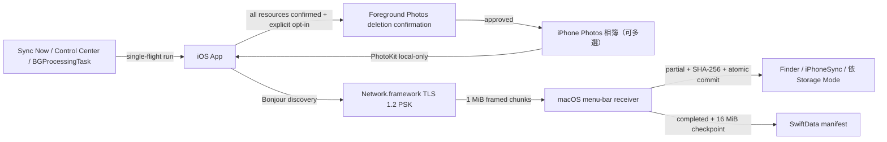

# iPhone Sync

`iPhone Sync` v1.0 — 一套原生 iPhone 與 Mac 的個人媒體備份工具 (personal media backup)，只走同一區域網路 (LAN)，不經雲端。

配對一次之後，iPhone 指定相簿中尚未備份、且已存在本機的完整原始資源 (original resource)，會單向增量傳送到自己的電腦。Optional `Delete After Sync` 預設關閉；只有明確啟用並完成全部資源驗證的 photos 才會進入 foreground deletion confirmation。

- 目錄 (Contents)
    - [1. 這是什麼 (What It Is For)](#1-這是什麼-what-it-is-for)
    - [2. 使用方式 (How to Use)](#2-使用方式-how-to-use)
    - [3. 安裝與設定步驟 (Setup Step by Step)](#3-安裝與設定步驟-setup-step-by-step)
    - [4. 驗證、設定與邊界 (Verification, Settings, Boundaries)](#4-驗證設定與邊界-verification-settings-boundaries)
    - [5. App Store 送審必填資訊 (App Store Submission)](#5-app-store-送審必填資訊-app-store-submission)

## 1. 這是什麼 (What It Is For)

`iPhone Sync` 提供兩種對等的接收端：macOS menu-bar receiver（原 MVP）與 Windows 11 desktop receiver（Electron + Node.js port）。iPhone sender 透過 Bonjour 自動看見所有 `_iphonesync._tcp` 服務，由使用者在 iPhone 端挑選要同步到哪台電腦；Mac 與 Windows 共用同一份 wire protocol（`protocolVersion = 1`），iOS App 不需區分平台。

### 解決的問題 (Problem)

| 情境                                     | 既有做法的痛點            | `iPhone Sync`                                  |
| ---------------------------------------- | ------------------------- | ---------------------------------------------- |
| 想把 iPhone 相簿原始檔留在自己的硬碟     | iCloud 需付費且是雲端副本 | LAN 直傳到你選的 Finder 資料夾                 |
| 想保留 RAW、影片、Live Photo、adjustment | AirDrop 逐張手動、易漏    | 依相簿整批增量，只補未備份的                   |
| 想要固定備份而不用每天記得               | 手動流程一定會忘          | opt-in `Automatic Sync`，由 iOS 於背景擇機執行 |
| 備份完成後想釋放 iPhone 空間             | 逐張核對與刪除容易出錯    | opt-in `Delete After Sync`，只處理完整確認資產 |
| 不想把照片交給第三方服務                 | 多數工具需要帳號或雲端    | 無帳號、無伺服器、無 Internet relay            |

### 業務定義 (Business Definition)

- 來源固定為一部 iPhone 上由使用者選取的一個或 多個 Photos 相簿。
- 目的地固定為一部已配對 Mac 上的 Finder folder；實際寫入位置固定在 `<selected-folder>/iPhoneSync/` 之下，版面由 `Storage Mode` 決定。
- 同步只新增；iPhone 刪除不會傳播至 Mac，也不覆寫 Mac 既有的不同內容。
- `Delete After Sync` 預設關閉；未啟用時 App 絕不刪除 Photos assets。啟用後也只刪除每個本機 original resource 都已由 receiver 確認完成的整個 asset。
- 刪除是 Photos library-wide，不是只移出所選相簿；使用 `iCloud Photos` 時也可能同步影響同 Apple Account 的其他裝置。每個 foreground batch 仍由 Photos 顯示 system confirmation。
- 傳輸只使用同一區域網路，不使用 AirDrop、Bluetooth、Internet relay 或雲端服務。
- 備份保留 PhotoKit 提供的原始 resource bytes，包括 RAW、影片、Live Photo components 與 adjustment data。
- 不在 iPhone 本機的 iCloud Photos resource 會被跳過，App 不會自動下載。
- 兩個不同相簿若名稱相同，第一個使用原名，後續穩定使用 `名稱 (2)`、`名稱 (3)`，不會合併。
- Automatic sync 是 opt-in、best-effort；`Sync Now` 永遠是可立即觸發的 fallback。

### Domain Flow



### 影片示範腳本 (Video Demo Transcript)

目標長度 `0:30`，六個鏡頭。`畫面` 為錄影內容，`旁白` 為配音逐字稿；配對與目的地選擇在開拍前完成，只錄操作結果。

| 時間   | 畫面 (Screen)                                                                     | 旁白 (Narration)                                                  |
| ------ | --------------------------------------------------------------------------------- | ----------------------------------------------------------------- |
| `0:00` | Mac menu bar 圖示，Setup 顯示已選好的目的地資料夾                                 | 「把 iPhone 相簿的原始檔，走區域網路備份到自己的 Mac。」          |
| `0:05` | 點 `Pair iPhone`，大字六位數配對碼與兩分鐘倒數                                    | 「Mac 顯示六位數字，這組數字不走網路，只用來確認是這台。」        |
| `0:11` | iPhone 選兩個相簿，按 `Find Mac`，輸入六位數，顯示已配對                          | 「iPhone 挑相簿，輸入數字，配對一次就好。」                       |
| `0:17` | 按 `Sync Now`，進度列跑動；Mac Finder 同時長出 `iPhoneSync/Trip 2026/2026/07/`    | 「按下同步，檔案驗完 SHA-256 才落地，就是一般的 Finder 資料夾。」 |
| `0:24` | 再按一次 `Sync Now`，摘要 `Added 0` / `Already 812`；帶到 `Automatic Sync` toggle | 「重跑只補新的。打開自動同步，之後不用再記得。」                  |
| `0:29` | 回到 Mac menu bar 圖示，淡出                                                      | 「你的照片，你的硬碟。」                                          |

錄影前置檢查 (pre-flight)：Mac 與 iPhone 同一 Wi-Fi、iPhone 已關閉勿擾以外的通知、備份目的地先清空、`Operation Log` 先 clear。

## 2. 使用方式 (How to Use)

### 日常流程 (Daily Flow)

1. Mac 保持登入即可，menu-bar receiver 會自動恢復 destination、配對與 manifest。
2. iPhone 端有四種觸發同步的入口：

| 入口             | 位置                                        | 行為                                                |
| ---------------- | ------------------------------------------- | --------------------------------------------------- |
| `Sync Now`       | iPhone 主畫面 Mac 卡片                      | 立即前景同步，永遠可用的 fallback                   |
| Control widget   | 控制中心自訂項目 `Sync Now`                 | 不開啟 App，透過 `SyncNowIntent` 觸發既有 sync 入口 |
| 1x1 shortcut     | Shortcuts / Siri：`Sync now in Photo Sync`  | 同上，走同一個 `handleIncomingURL` 路徑             |
| `Automatic Sync` | 主畫面 `AUTOMATIC SYNC` 區                  | opt-in 後由 iOS `BGProcessingTask` best-effort 啟動 |

1. 同步中可按 `Cancel`；同一時間只允許一個 run（single-flight）。
2. 完成後 `LAST SYNC` 顯示 `Added` / `Already` / `Not local` / `Failed` 四項摘要。
3. 若明確啟用 `Delete After Sync`，foreground sync 完成後 Photos 會要求確認刪除；background sync 只建立 pending list 並發通知提醒，回到 App 後按 `Delete N Synced Photos`。

### 檔案落點 (Storage Mode)

Mac Setup 的 `Storage Mode` 決定 `iPhoneSync` 容器內的版面，固定容器本身不可變更：

| 模式                           | 實際路徑                                                 | 適用                   |
| ------------------------------ | -------------------------------------------------------- | ---------------------- |
| `Album / Year / Month`（預設） | `<destination>/iPhoneSync/<album>/<year>/<month>/<file>` | 相簿多、時間跨度長     |
| `Album`                        | `<destination>/iPhoneSync/<album>/<file>`                | 相簿即分類，不需日期層 |
| `Single Folder`                | `<destination>/iPhoneSync/<file>`                        | 之後交給其他工具再分類 |

若選取的 destination root 是 symbolic-link folder，Mac 會先解析並保存實際 target folder，`iPhoneSync` 也固定寫入該 target。`iPhoneSync` 容器、相簿資料夾與日期子資料夾若是 symbolic link，只要解析後是實際存在的資料夾，就當一般資料夾使用，target 也可以位於 destination root 之外（例如外接硬碟）；實際能否寫入仍取決於 macOS 授予的 sandbox 權限。解析不到資料夾（斷掉的連結或指向檔案）與同名檔案仍會拒絕，並顯示於 Mac `Operation Log`。已存在的資料夾會直接重用並保留全部內容；切換模式不會搬動或刪除既有 committed 檔案。

### Automatic Sync 的真實語意

- **每 30 分鐘嘗試一次**。沒有指定時間、沒有每日配額，成功與失敗都以相同的 30 分鐘重新排下一次。
- 不要求充電：電池供電時 iOS 一樣可能啟動 automatic sync。實際啟動時機與視窗長度由 iOS 判斷，App 不讀取電池狀態。
- 單次執行時間`不設上限`：iOS 給多久就傳多久，到點由系統中止，未傳完的部分由 Mac / Windows 的 checkpoint 續傳。
- 上一次還在執行時，下一次啟動直接略過，並立刻重新排程，不會有兩條連線。
- 全部都只是 `earliestBeginDate`。iOS 不保證準時、不保證固定週期、不保證一定提供 runtime，實際執行可能晚很多。
- App 啟動與 scene 切換會 reconcile 既有 pending request：同一 request 若不晚於目前目標便保留，不重複提交、不把 `Next attempt` 往後推。
- Mac 不可達、系統未啟動 background task 或背景排程不可用時，請直接用 `Sync Now`。

### Delete After Sync 的安全語意

- `Delete After Sync` 是獨立、持久化且預設關閉的 toggle；關閉或按 `Forget` 時會清除 pending deletion IDs。
- 刪除單位是整張 photo / video / Live Photo 對應的 `PHAsset`。每個 PhotoKit resource 都必須在每個已選相簿 session 收到 `committed` 或 `already present`；只要一個 resource 是 `Not local`、failed、cancelled 或尚未完成，整個 asset 都保留。
- Foreground manual run 完整成功後，App 以一個 PhotoKit change batch 請求刪除，iOS 仍顯示 system confirmation。使用者取消時不刪除，candidate 保留為 pending。
- System-launched background run 無法安全顯示 foreground change confirmation，因此只保存 fully backed-up asset ID / `modificationDate` snapshots，並在取得通知授權時發出一則 local notification 告知有幾張照片等待確認。回到 App 後，`AFTER SYNC` card 顯示數量與 `Delete N Synced Photos` button；刪除前版本已改變的 asset 會保留，必須等下一次完整同步。通知只說數量，不含任何 asset identifier；完成刪除、關閉 toggle 或按 `Forget` 時撤回。
- Photos deletion 會從整個 library 移除 asset，不是只從所選相簿移除；若使用 `iCloud Photos`，也會影響同 Apple Account 的其他裝置。Receiver 已 committed 的 Finder / Windows files 永遠保留。

完整 contract 見 [Delete After Sync 規格](docs/specs/2026-07-27-delete-after-sync.md)。

### 螢幕鎖定與背景化 (Lock and Backgrounding)

前景 `Sync Now` 進行中 iPhone 不會自動鎖定，長片段也能一次傳完；完成或取消後自動鎖定立刻恢復。若手動按側邊鍵鎖定或切到其他 App，iOS 會停止這個前景 run：App 會先安全關閉連線再結束，receiver 隨即回到 `Ready`，下一次同步從 manifest checkpoint 續傳，不會重傳已完成的位元組。receiver 對已開啟但停止送資料的 session 另有 45 秒 deadline，因此就算 iPhone 被直接 suspend 或 Wi-Fi 斷線，Mac 也不會卡在舊 session 而拒絕後續連線。

### 網路前提 (Network Gate)

iPhone 必須使用 Wi-Fi；Mac 可使用同一 LAN 的 Wi-Fi 或 Ethernet。Manual 與 automatic run 都以「Bonjour 可見 exact paired `receiverID`，且保存的 PSK 能完成 TLS handshake」作為同網路 gate，不比較 SSID 或 IP subnet。Bonjour 若被 guest network、VLAN、VPN 或 router client isolation 阻擋，App 不會繞過網路限制。

### Operation Log

iPhone 主畫面與 Mac Setup 都有 `Operation Log` panel，以 `info`、`success`、`warning`、`error` 顯示 App、設定、Photos、相簿、配對、discovery、scheduler、listener、session、resource 與 sync outcome。兩端各保留最新 `500` 筆並同步寫入 Apple Unified Logging；iPhone 可展開全部或清除，Mac 可 `Copy All` 或清除。iPhone 端的 timeline `跨 App 啟動保存`：背景 automatic run 是在 iOS 短暫喚醒、結束後即終止的 process 裡執行的，若只留在記憶體，那次 run 的所有事件（包含「有照片等待前景刪除確認」）會在 process 結束時消失，背景行為將無從稽核。Mac receiver 是常駐 process，維持 in-memory buffer。為避免大型影片洗掉可讀事件，panel 記錄每個 resource lifecycle，不逐一記錄 1 MiB chunk。PSK、六位數 pairing code、cryptographic identity、source binding 與 content hash 不會進入 panel。

## 3. 安裝與設定步驟 (Setup Step by Step)

### 3.1 依賴 (Dependencies)

技術脈絡與版本決策的單一來源為 [CLAUDE.md](CLAUDE.md)。

| 依賴                   | 版本 / 來源                            | 用途                                                    |
| ---------------------- | -------------------------------------- | ------------------------------------------------------- |
| macOS                  | `14.0+`（receiver 部署目標）           | 執行 Mac menu-bar receiver                              |
| iOS                    | `18.0+`（sender 部署目標）             | 執行 iPhone sender 與 Control Center 控制項             |
| Xcode                  | `26.0`（`project.yml` `xcodeVersion`） | 建置兩個 App target                                     |
| Swift                  | `6.0`                                  | `SyncCore` / `MacReceiverKit` 與兩個 App                |
| XcodeGen               | `brew install xcodegen`                | 由 `project.yml` 產生 project、Info.plist、entitlements |
| jq                     | `brew install jq`                      | `scripts/verify.sh` 解析 simulator 清單                 |
| plutil                 | macOS 內建                             | 驗證產生的 plist 與挑選實體裝置                         |
| xcrun devicectl        | Xcode 內建                             | 安裝、啟動實體 iPhone 與附掛 console                    |
| Apple Development 簽署 | Apple ID + development team            | 實機安裝、sandbox 授權、launch at login                 |

`project.yml` 是 Xcode target、Info.plist 與 entitlements 的唯一來源；不要直接修改產生後的 `apps/*/Info.plist` 或 `*.entitlements`。權限逐項說明見 [README.permission.md](README.permission.md)。

```bash
brew install xcodegen jq
xcodegen generate
```

產生的 `iPhoneSync.xcodeproj`、Info.plist 與 entitlements 已提交，checkout 後不安裝 XcodeGen 也能直接開啟專案。

### 3.2 Mac 端設定 (Receiver)

```bash
./scripts/run-server.sh
```

此腳本重新產生 project、以 `Debug` 建置 `iPhoneSyncMac`、停止舊 process，並帶 `--open-setup` 啟動 App。可用旗標：`--build-only`（只建置）、`--no-build`（只啟動既有建置）。

要長期使用而不是改一行看一次，改成安裝進 `/Applications`：

```bash
npm run deploy:mac
```

此腳本以 `Release` 建置、簽章（預設 ad-hoc，`MAC_SIGN_IDENTITY` 可換 Developer ID）、結束執行中的舊版本，再取代 `/Applications/iPhone Sync.app` 並啟動。旗標 `--no-launch` 只安裝不啟動；`INSTALL_DIR` 可改安裝位置。ad-hoc 簽章每次建置都是新的 code identity，login Keychain 中的 PSK 與 destination bookmark 會需要重新授權；要保留既有配對就設固定的 Developer ID。散佈給別人仍走 `npm run build:mac` 產生的 DMG / PKG。

或在 Xcode 開啟 `iPhoneSync.xcodeproj`，為 `iPhoneSyncMac` 選擇開發團隊後執行。

1. menu bar 出現 `iPhone Sync` 圖示，點開選 `Open Setup`。
2. 按 `Choose Destination`，第一次會預設開在 `Downloads`；選定 symbolic-link folder 時會固定解析至實際 target，再由 sandbox 以 security-scoped bookmark 保存權限。
3. 選擇 `Storage Mode`。
4. 按 `Pair iPhone`，畫面顯示六位數配對碼與兩分鐘倒數。
5. macOS 15+ 首次會出現 Local Network 授權提示，必須允許。

若 menu bar 空間不足看不到圖示：騰出一個位置，按住 `Command` 把 `iPhone Sync` 拖近右側，位置會由 autosave name 保存。

### 3.3 iPhone 端設定 (Sender)

```bash
npm run deploy:ios                             # Debug 建置、安裝、啟動（實機）
npm run dev:ios                                # 同上，但跑在 iOS Simulator
./scripts/run-iphone.sh --profile=production   # Release
npm run build:ios                              # 只產生已簽署 archive → build/iphone/iPhoneSync.xcarchive
```

腳本會自動解析 Apple Development team、以 `xcrun devicectl` 挑選唯一一台已配對且連線的實體 iPhone。多台裝置時設 `DEVICE_UDID`；多組團隊時設 `DEVELOPMENT_TEAM`。前提是 iPhone 已解鎖、已信任這台 Mac 並開啟 `Developer Mode`。

1. 首次啟動授予 `Photos Full Access`（`.limited` 不被接受）。
2. 按 `Choose Albums` 選一個或多個相簿。
3. 按 `Find Mac`，首次會出現 Local Network 授權提示，必須允許。
4. 從候選清單選擇 Mac，輸入 Mac 顯示的六位數配對碼。
5. 按 `Sync Now` 完成第一次同步。
6. 需要背景同步再打開 `Automatic Sync` 並設定 `Schedule time`；需要一鍵觸發則到控制中心加入 `Sync Now` 控制項。
7. 只有確定要在完整備份後刪除來源時才打開 `Delete After Sync`；閱讀 library-wide / iCloud Photos 警告並確認。保持關閉時不會刪除任何 photos。

### 3.4 除錯 (Debugging)

Mac receiver：

```bash
./scripts/run-server.sh --build-only                      # 只驗證編譯
log stream --predicate 'subsystem CONTAINS "iphonesync"'  # Unified Logging 即時串流
```

- Setup 的 `Operation Log` 是第一現場，可 `Copy All` 直接貼出。
- 完整事件（含 listener retry、wake/path reconcile）同時進入 Apple Unified Logging。
- destination bookmark 失效時 App 會要求重新選擇資料夾，不會靜默失敗。
- `Forget iPhone` 只刪 Keychain trust，`Reset Source` 只建立新的 source binding，兩者都不刪 Finder 檔案。

iPhone sender：

```bash
./scripts/run-iphone.sh --console   # 重啟 App 並附掛 process console
```

- 主畫面 `Operation Log` 展開後可看到 App、Photos、相簿、配對、discovery、scheduler、run、session 與每個 resource 的 levelled 事件；背景 automatic run 的事件跨 App 啟動保存，可事後回查那次 run 到底做了什麼。
- `Delete After Sync` 的 pending count 與每次 request / success / cancel / skip 都記在 `Operation Log`；log 只記數量，不包含 Photos asset identifiers。背景 run 留下 pending 時另發一則 local notification；若沒收到，先確認 iOS 設定裡本 App 的通知未被關閉，`Operation Log` 仍會留下同一筆紀錄。
- 背景排程被系統拒絕時，`Background App Refresh` 文字與 `Operation Log` 會標示原因。
- Control Center 觸發若無反應，先確認已配對且 prerequisites 齊全；不符合時 `Operation Log` 會記一筆 `Widget trigger ignored`。

常見狀況：

| 症狀                  | 檢查點                                                                                                   |
| --------------------- | -------------------------------------------------------------------------------------------------------- |
| `Find Mac` 找不到 Mac | 兩端同一 Wi-Fi、Mac 配對視窗仍在兩分鐘內、非 guest network / VLAN / VPN、router 未開 client isolation    |
| 配對碼輸入失敗        | 碼已逾時（120 秒）或嘗試次數用盡，回 Mac 重新 `Pair iPhone`                                              |
| 大量 `Not local`      | 該資源只在 iCloud，App 固定 `isNetworkAccessAllowed = false`，需先在 Photos 下載到本機                   |
| Automatic 從未執行    | `earliestBeginDate` 不是保證；先確認 `Background App Refresh` 可用，再用 `Sync Now` 作為 fallback |
| 已同步但尚未刪除      | Background run 只建立 pending list；回到 App，在 `AFTER SYNC` 按 `Delete N Synced Photos` 並確認         |
| Mac 寫入被拒          | 目的地同名項目是檔案，或 symlink 解析不到資料夾，`Operation Log` 會標示；換一個 destination 或移除該項目 |

## 4. 驗證、設定與邊界 (Verification, Settings, Boundaries)

### 驗證 (Verification)

```bash
bash scripts/verify.sh                          # canonical 全量驗證（含 SyncCore.Windows 49 tests + 兩 build + source invariants）
swift test --package-path packages/SyncCore     # 只跑 Swift package tests
```

驗證入口會執行 Swift package tests、重新產生 Xcode project、建置 macOS、iOS Simulator 與 `Release` generic iOS device targets、檢查 plist / entitlements / local-only source invariants，以及 tracked、staged、untracked whitespace checks。`Release` device build 會實際編譯上架用的組態。建置使用 `CODE_SIGNING_ALLOWED=NO`。

Windows 11 receiver 端會額外跑 `scripts/verify-windows.sh`：49 個 vitest、SyncCore.Windows 與 apps/windows 兩個 TypeScript build、source-string invariants（HKDF labels、`IPS1` magic、`iPhoneSync` 容器、`TLS_PSK_WITH_AES_128_GCM_SHA256`、`powerMonitor` 等）。`npm run dist`（NSIS + portable）只在 Windows MSYS shell 觸發。

最近一次 canonical 通過紀錄為 `54` 個 Swift package tests、`41` 個 iOS unit tests、`49` 個 Windows vitest、三個 Apple builds 與兩個 TypeScript builds。Mac half-open deadline 有 package behavior test；其餘 receiver recovery、`BGProcessingTask` lifecycle 與 PhotoKit deletion 主要是編譯 / source-invariant / injected-service tests，不等同完整行為測試或實機驗收。

### 建置產物位置 (Build Output Locations)

所有本機建置產物都落在 repo 根目錄的 `build/`（已被 `.gitignore` 忽略），Windows 端則落在各自的 package 目錄下。`npm run clean` 會清掉 `build/`、TypeScript `dist/` 與 Swift package build。

| 指令                   | 腳本 / 工具        | 產物                                        | 位置                                                                    |
| ---------------------- | ------------------ | ------------------------------------------- | ----------------------------------------------------------------------- |
| `npm run dev:ios`      | `run-simulator.sh` | Simulator `.app`                            | `build/simulator/Build/Products/Debug-iphonesimulator/iPhone Sync.app`  |
| `npm run deploy:ios`   | `run-iphone.sh`    | 已簽署 archive（安裝到實機）                | `build/iphone/iPhoneSync.xcarchive`（derived data 在 `build/iphone/DerivedData`） |
| `npm run build:ios`    | `run-iphone.sh`    | 同上，只建置不安裝                          | `build/iphone/iPhoneSync.xcarchive/Products/Applications/iPhone Sync.app` |
| `npm run release:ios`| `release.sh`       | App Store archive + `.ipa`                  | `build/appstore/iPhoneSync.xcarchive`、`build/appstore/ipa/*.ipa`       |
| `npm run dev:mac`      | `run-server.sh`    | Debug `.app`（原地啟動）                    | `build/mac/DerivedData/Build/Products/Debug/iPhone Sync.app`            |
| `npm run deploy:mac`   | `run-mac.sh`       | Release `.app`（安裝後啟動）                | 建置於 `build/mac-install-derived/`，安裝至 `/Applications/iPhone Sync.app` |
| `npm run build:mac`    | `package-mac.sh`   | universal DMG + PKG                         | `build/mac-dist/iPhoneSync-Mac-<version>.{dmg,pkg}`（中繼在 `build/mac-release-derived/`） |
| `npm run build:windows`| `electron-builder` | NSIS installer + portable `.exe`            | `apps/windows/dist-installer/iPhoneSync-{Setup,Portable}-<version>.exe` |
| `npm run build:windows`| `tsc`              | 編譯後的 JavaScript                         | `packages/SyncCore.Windows/dist/`、`apps/windows/dist/`                  |

`INSTALL_DIR` 可改 `deploy:mac` 的安裝目的地；`BUILD_ROOT`、`DERIVED_DATA_PATH`、`APP_PATH` 可覆寫各腳本的建置根目錄。

### Desktop Release (GitHub Actions)

`.github/workflows/release.yml` 用同一個 trigger 打包 macOS 與 Windows 兩個 receiver，並發佈到同一個 GitHub Release，使用者從 Release 頁面下載即可一鍵安裝：

1. `macos-latest`：SyncCore package tests + `bash scripts/package-mac.sh` → `iPhoneSync-Mac-<version>.dmg`（拖進 Applications）與 `iPhoneSync-Mac-<version>.pkg`（雙擊安裝到 /Applications）
2. `windows-latest`：vitest + `npm run dist` → `iPhoneSync-Setup-<version>.exe`（NSIS installer）與 `iPhoneSync-Portable-<version>.exe`
3. `publish`：下載兩端 artifacts，把 `.dmg` / `.pkg` / `.exe` 全部掛上同一個 Release

Trigger：

- `v*` tag push → 自動建立 Public Release（tag 版本 stamp 進兩端 artifact 檔名與 bundle version）
- `workflow_dispatch` → Manual 建立 Draft Release

未設定 Apple Developer ID secrets 時，mac artifacts 為 ad-hoc 簽章：下載後首次開啟會被 Gatekeeper 攔下，需在「系統設定 → 隱私權與安全性」按「強制打開」（或 `xattr -dr com.apple.quarantine "/Applications/iPhone Sync.app"`）。提供 `MAC_SIGN_IDENTITY` / `MAC_NOTARY_*` 環境後，同一腳本自動升級為 Developer ID 簽章 + notarization，安裝就不再有警告。Windows 端未簽 Authenticode 前，SmartScreen 可能顯示「其他資訊 → 仍要執行」。

本地打包 / 預覽（macOS 開發機）：

```bash
bash scripts/package-mac.sh         # → build/mac-dist/iPhoneSync-Mac-<version>.{dmg,pkg}
bash scripts/run-mac.sh             # → /Applications/iPhone Sync.app（本機安裝，不產生 DMG/PKG）
bash scripts/verify-windows.sh      # 49 tests + 2 builds + invariants pass
```

### 持久化設定 (Persistent Settings)

App 設定依資料敏感度使用 Apple 原生持久層，不集中到單一可讀檔案：

| Data                                                                                       | Persistent Store                                                                 |
| ------------------------------------------------------------------------------------------ | -------------------------------------------------------------------------------- |
| automatic sync enablement、last attempt/success/outcome、next eligible time、schedule time | iOS sandbox `UserDefaults`，由 `IOSAutomaticSyncStore` 管理                      |
| delete-after-sync enablement、pending Photos asset ID / `modificationDate` snapshots       | iOS sandbox `UserDefaults`，由 `IOSDeleteAfterSyncStore` 管理                    |
| receiver ID、source binding、storage mode、launch-at-login intent                          | sandbox `UserDefaults`，由 `MacSettingsStore` 管理                               |
| Finder destination permission                                                              | security-scoped bookmark in sandbox preferences                                  |
| paired iPhone PSK、opaque identity                                                         | login Keychain                                                                   |
| album mappings、完成狀態、續傳 checkpoint                                                  | SwiftData in App container `Application Support`                                 |
| 開機自動執行                                                                               | `SMAppService.mainApp` login item registration                                   |
| Setup window size/position、menu-bar item position                                         | AppKit autosave                                                                  |
| iOS operation timeline                                                                     | App container 內的 bounded on-disk log（最新 500 筆，跨啟動保存）+ Apple Unified Logging |
| macOS operation timeline                                                                   | 常駐 App process 的 bounded in-memory buffer（最新 500 筆）+ Apple Unified Logging |

`Automatic Sync` 預設關閉；關閉時取消 pending request 與 active automatic run，不刪除 pairing、相簿選擇、partial 或 manifest。`Delete After Sync` 也預設關閉；關閉時清除 pending deletion IDs 且不呼叫 PhotoKit deletion，receiver files 不受影響。`Launch at Login` 首次預設啟用，使用者關閉後保存該選擇。六位數 pairing code、active connection 與 active deletion request 是 transient runtime state，不跨重啟保存；Mac 的 operation timeline 同樣是 transient，iPhone 的則跨啟動保存。

### 安全與資料邊界 (Security Boundaries)

- 初次配對使用 ephemeral Curve25519 key agreement；六位數僅作 short authentication string (SAS)，不透過網路傳送，也不是加密金鑰。
- 配對成功後導出的 256-bit secret 與 opaque identity 存入 Keychain，正常同步使用 TLS 1.2 static PSK (`TLS_PSK_WITH_AES_128_GCM_SHA256`)。
- iPhone discovery 與連線固定 `includePeerToPeer = false`，不走 Bluetooth / AWDL fallback。
- Automatic run 每次重新 discovery 與 authentication，不保存 IP、port、`NWEndpoint`，也不維持常駐 socket 或 heartbeat。
- PhotoKit request 固定 `isNetworkAccessAllowed = false`，不因同步而觸發 iCloud 下載。
- Optional deletion 只在 asset 的所有 local resources 已由 receiver authoritative manifest 確認後提出；toggle off、not-local、partial、cancel 或 failed asset 永遠保留。Photos system confirmation 被拒絕時也不刪除。
- Receiver 先驗證 frame、offset、expected size 與 SHA-256，完成後才以不覆寫方式 atomic commit；同一 resource 第二次 integrity mismatch 會終止 session。
- Mac 不要求 Full Disk Access，只寫入使用者以 `NSOpenPanel` 選取的 destination。

### 專案狀態 (Project Status)

MVP、多相簿同步、`Automatic Sync` scheduler / single-flight runtime、default-off `Delete After Sync`、Mac listener recovery、三種 storage mode、Control Center / Shortcuts 觸發、兩端 `Operation Log` panels、typed persistent settings 與 UI design tokens 已完成，並通過 canonical `bash scripts/verify.sh`。

尚未完成、以 [README.todo](README.todo) 為準：signed 實機的 Photos deletion confirmation / iCloud propagation、background launch / expiration 模擬、overnight 自然排程觀察、完整 LAN failure matrix，以及簽署、公證 (notarization) 與發佈方式的決定。

### 文件索引 (Documentation Index)

| 文件                                                                                                         | 內容                                     |
| ------------------------------------------------------------------------------------------------------------ | ---------------------------------------- |
| [CLAUDE.md](CLAUDE.md)                                                                                       | 技術脈絡、架構、依賴方向、已核准技術選擇 |
| [README.permission.md](README.permission.md)                                                                 | iOS / macOS 權限與能力逐項說明           |
| [README.todo](README.todo)                                                                                   | 待辦與實機驗收清單                       |
| [web/index.html](web/index.html)                                                                             | 對外上手指南站，部署於 `iphone-sync.shuks.dev` |
| [apps/ios/README.md](apps/ios/README.md)                                                                     | iPhone sender 的 flow 與邊界             |
| [apps/macos/README.md](apps/macos/README.md)                                                                 | Mac receiver 的 flow 與邊界              |
| [apps/windows/README.md](apps/windows/README.md)                                                             | Windows 11 receiver 的 flow 與邊界       |
| [packages/SyncCore/README.md](packages/SyncCore/README.md)                                                   | 傳輸協定、crypto、manifest 與 writer     |
| [docs/specs/2026-07-19-local-album-sync-design.md](docs/specs/2026-07-19-local-album-sync-design.md)         | 原始 MVP 設計                            |
| [docs/specs/2026-07-23-automatic-lan-sync.md](docs/specs/2026-07-23-automatic-lan-sync.md)                   | Automatic LAN sync 規格                  |
| [docs/specs/2026-07-24-ui-redesign.md](docs/specs/2026-07-24-ui-redesign.md)                                 | UI design tokens 與版面規格              |
| [docs/specs/2026-07-25-windows-11-desktop-receiver.md](docs/specs/2026-07-25-windows-11-desktop-receiver.md) | Windows 11 desktop receiver 設計         |
| [docs/specs/2026-07-27-delete-after-sync.md](docs/specs/2026-07-27-delete-after-sync.md)                     | 同步後 optional Photos deletion contract |
| [plans/2026-07-23-operation-log-panels.md](plans/2026-07-23-operation-log-panels.md)                         | Operation timeline contract              |
| [plans/2026-07-25-windows-11-desktop-receiver.md](plans/2026-07-25-windows-11-desktop-receiver.md)           | Windows 11 port 實作計畫                 |

## 5. App Store 送審必填資訊 (App Store Submission)

送審對象是 iOS sender（`iPhoneSyncIOS`）。macOS 與 Windows receiver 目前走 GitHub Release 直接下載，不在此次 App Store 送審範圍。以下值全部由 `project.yml`、`appstore/` policy package 與已上線的 policy URLs 佐證；標示 `決定中` 者尚未確認，不可直接貼進 App Store Connect。

### 5.1 App Information（App 層級，跨版本共用）

| App Store Connect 欄位  | 值                           | 佐證                                                                     |
| ----------------------- | ---------------------------- | ------------------------------------------------------------------------ |
| Name（≤30）             | `Photo Sync`                 | `project.yml` iOS target `CFBundleDisplayName` / `CFBundleName`         |
| Subtitle（≤30）         | `Album backup over your LAN` | 26 字元                                                                  |
| Bundle ID               | `com.shuk.iphonesync.ios`    | `project.yml` `PRODUCT_BUNDLE_IDENTIFIER`                                |
| SKU                     | `iphone-sync-ios`            | 內部識別，不對外顯示                                                     |
| Primary Language        | `English (U.S.)`             | 專案無 `.lproj` / `.xcstrings`，僅英文                                   |
| Primary Category        | `Utilities`                  | Mac target `LSApplicationCategoryType` = `public.app-category.utilities` |
| Secondary Category      | `Photo & Video`              | 建議值                                                                   |
| Age Rating              | `4+`                         | 無 UGC 分享、無廣告、無 web browser、無 in-app purchase                  |
| License Agreement       | `Apple Standard EULA`        | `appstore/copyright.html`                                                |
| Copyright               | `2026 BizShuk`               | `appstore/copyright.html`                                                |
| Content Rights          | 不含第三方內容               | 媒體全部由使用者自有 Photo Library 提供                                  |
| Trader Status（EU DSA） | `決定中`                     | 需由 developer/legal entity 確認個人或商業 trader                        |

### 5.2 Version Information（1.0.0 版本層級）

| 欄位                  | 值                                                       | 佐證                                                                                    |
| --------------------- | -------------------------------------------------------- | --------------------------------------------------------------------------------------- |
| Version               | `1.0.0`                                                  | `project.yml` `MARKETING_VERSION`                                                       |
| Build                 | `2`                                                      | `project.yml` `CURRENT_PROJECT_VERSION`                                                 |
| Minimum OS            | `iOS 18.0`                                               | `project.yml` `deploymentTarget`                                                        |
| Device Family         | iPhone only、Portrait only                               | `TARGETED_DEVICE_FAMILY: 1`、`UIRequiresFullScreen`、`UISupportedInterfaceOrientations` |
| Privacy Policy URL    | <https://bizshuk.github.io/pkg/iphone_sync/privacy.html> | 2026-08-12 實測 `200`                                                                   |
| Support URL           | <https://bizshuk.github.io/pkg/iphone_sync/index.html>   | 2026-08-12 實測 `200`                                                                   |
| Marketing URL（選填） | <https://bizshuk.github.io/pkg/iphone_sync/index.html>   | 同上                                                                                    |
| What's New            | 首次發佈，留空                                           | —                                                                                       |

Promotional Text（≤170）：

```text
Back up the albums you choose to a computer you own over Wi-Fi. Original resources only, verified by SHA-256, and nothing ever leaves your local network.
```

Keywords（≤100，逗號分隔、不加空白於逗號後）：

```text
backup,album,photo,video,local network,wifi transfer,originals,raw,live photo,offline,private
```

Description（≤4000）：

```text
Photo Sync copies the original resources of the albums you choose to a computer you own on the same local network. There is no cloud, no account, and no developer relay. Your photos go from your iPhone to your own disk and nowhere else.

Pair once with the free Mac or Windows receiver, choose the albums you want, and the app transfers everything that is not backed up yet. Run it by hand from the app, from a Control Center button, or from a Shortcut. Turn on Automatic Sync and iOS will pick a moment after the daily time you set.

WHAT GETS BACKED UP
- Original resources as PhotoKit provides them, including RAW, video, Live Photo components, and adjustment data.
- Multiple albums at once, each into its own folder on the receiver.
- Only what is missing. Re-running the sync adds new items and leaves everything else untouched.

HOW IT STAYS SAFE
- Transfers are additive. Photo Sync never deletes or overwrites an existing file on the receiver.
- Every resource is verified with SHA-256 before it is committed to its final path.
- Interrupted transfers resume from a durable checkpoint instead of starting over.

HOW IT STAYS PRIVATE
- Discovery uses Bonjour on your local network. There is no internet relay and no sign-in.
- Pairing is explicit: the receiver shows a six-digit code that is never sent over the network.
- After pairing, transfers run over TLS with a pre-shared secret held in the Keychain.
- Photos that live only in iCloud are skipped rather than downloaded.

OPTIONAL: DELETE AFTER SYNC
Delete After Sync is off by default. When you turn it on, Photo Sync only offers a photo for deletion after the receiver has confirmed every one of its resources. Deletion always goes through the standard iOS confirmation, removes the item from your whole library rather than one album, and may affect other devices if you use iCloud Photos. Files already written to the receiver are never touched.

REQUIREMENTS
- A Mac running macOS 14 or later, or a PC running Windows 11, with the free receiver app installed from <RECEIVER_URL>.
- Both devices on the same Wi-Fi network, with Bonjour reachable. Guest networks, client isolation, and some VPN configurations will block discovery.
```

### 5.3 App Privacy（Privacy Nutrition Label）

| 問題                    | 答案                                       | 佐證                                                                  |
| ----------------------- | ------------------------------------------ | --------------------------------------------------------------------- |
| Data collected?         | `No, we do not collect data from this app` | 無 analytics / ads / crash SDK；App 不對開發者伺服器發任何請求        |
| Tracking?               | `No`                                       | 無 `ATT`、無廣告識別碼、無第三方 SDK                                  |
| Photos 是否 collected？ | 否                                         | 媒體只在使用者自選、自持的 receiver 之間傳輸，開發者不接收            |
| Third-party processors  | 無                                         | 僅使用 Apple 平台服務（PhotoKit、Bonjour、Keychain、BackgroundTasks） |

公開版本以 [appstore/privacy.md](appstore/privacy.md) 為 canonical wording，HTML 不得另寫第二份。

### 5.4 Export Compliance

| 欄位                            | 值             | 佐證                                                                                              |
| ------------------------------- | -------------- | ------------------------------------------------------------------------------------------------- |
| `ITSAppUsesNonExemptEncryption` | `false`        | `project.yml`；已內嵌 plist，上傳後不會再逐次詢問                                                 |
| 使用的加密                      | 全部由 OS 提供 | Network.framework TLS 1.2 PSK、CryptoKit Curve25519 / SHA-256 / HKDF、Security.framework Keychain |
| 自行實作演算法                  | 無             | 符合 EAR Category 5 Part 2 豁免                                                                   |

### 5.5 Screenshots 與 App Icon

| 資產                | 規格                 | 檔案                                                                                      |
| ------------------- | -------------------- | ----------------------------------------------------------------------------------------- |
| 6.9" iPhone（必要） | `1320 × 2868`        | `appstore/preview/iphone-page.png`、`iphone-operation-log.png`                            |
| 6.5" iPhone（相容） | `1284 × 2778`        | `appstore/preview/iphone-page-6.5.png`、`iphone-operation-log-6.5.png`                    |
| App Icon            | `1024 × 1024` 不透明 | `appstore/app-icon.png`（App 內為 `apps/ios/Sources/Assets.xcassets/AppIcon.appiconset`） |
| App Preview 影片    | 選填，未製作         | 腳本見 [影片示範腳本](#影片示範腳本-video-demo-transcript)                                |

截圖必須呈現實際 shipped 畫面。目前四張仍是舊畫面（含已移除的 `AUTOMATIC SYNC (DEBUG)` 卡片或舊名稱），送審前必須以 Release build 在已配對 iPhone 重拍。

拍完一律跑一次：

```bash
bash scripts/prepare-screenshots.sh          # 移除 alpha channel + 驗證尺寸
bash scripts/prepare-screenshots.sh --check  # 送審前 gate，只驗證不改檔
```

App Store Connect 拒收帶 alpha channel 的截圖，而 iOS 與模擬器截圖都會帶一條
（圓角處為透明），肉眼看不出來，上傳時才會被擋。

### 5.6 App Review Information

Sign-in 不需要帳號，`Demo account` 留空；但審查員必須有第二台裝置才能觀察到完整流程，Notes 必須說明這點：

```text
Photo Sync transfers photos to a receiver app running on a Mac or Windows PC on
the same local network. No account, no server, and no demo credentials are needed.

To review the full flow, install the free macOS receiver from <RECEIVER_URL>,
then:
1. Launch the receiver, open Setup, and choose any destination folder.
2. Press "Pair iPhone". The receiver shows a six-digit code.
3. On iPhone, grant Photos access and Local Network access, choose an album,
   press "Find Mac", pick the Mac, and enter the six-digit code.
4. Press "Sync Now". The selected album's originals appear in the destination
   folder under iPhoneSync/.

If a second machine is not available, the iPhone app alone still demonstrates
album selection, permission handling, discovery, and the operation log. Discovery
requires Bonjour on the local network; it will find no receiver otherwise.

Delete After Sync is off by default and is not exercised unless it is explicitly
enabled. When enabled it uses the standard PhotoKit deletion confirmation.

Local Network access is required for Bonjour discovery and the direct TLS
transfer. Background processing is used only for the opt-in Automatic Sync.
```

`App Review contact`：待填 developer 真實姓名、電話與 email（不寫入 repo）。

### 5.7 送審前尚未完成的項目 (Pre-submission Gaps)

逐欄 evidence 與完整 gap 清單見 [docs/app-store-connect.md](docs/app-store-connect.md)。以下每一項都會影響能否通過審查或上傳，尚未完成：

- **截圖仍是舊畫面**：四張都含已移除的 `AUTOMATIC SYNC (DEBUG)` 卡片或舊名稱，屬 `Guideline 2.3`。需以 Release build 在已配對 iPhone 重拍，再跑 `scripts/prepare-screenshots.sh`。
- **缺少 `PrivacyInfo.xcprivacy`**：iOS target 使用 `UserDefaults`（reason `CA92.1`）與 `FileManager.attributesOfItem`（file timestamp，reason `C617.1`）等 required-reason APIs，未附 privacy manifest 會在上傳後收到 `ITMS-91053` 通知。
- ~~**Receiver 下載路徑未定案**~~：repo 已轉為 public，四個 receiver 安裝檔固定掛在 `https://github.com/BizShuk/iphone_sync/releases/latest/download/`（`iPhoneSync-Mac.dmg` / `.pkg`、`iPhoneSync-Setup.exe` / `iPhoneSync-Portable.exe`），審查員可直接取得。
- **公開 policy 站台未重新發佈**：`appstore/*.html` 已改名為 `Photo Sync`，`bizshuk.github.io` 上的線上版本仍是舊文案。
- **App Store Connect app record 與 distribution 憑證未齊備**：`npm run release:ios` 在未設定 `DEVELOPMENT_TEAM` / `ASC_KEY_ID` / `ASC_ISSUER_ID` 時會在 archive 前失敗（見 [CLAUDE.md](CLAUDE.md)）。
- **實機驗收未完成**：signed 裝置上的 `Delete After Sync` confirmation、background launch 與完整 LAN failure matrix 仍列於 [README.todo](README.todo)。

## 6. 授權 (License)

本專案採用 [PolyForm Noncommercial License 1.0.0](LICENSE)：`個人與非商業用途完全開放`，可以自由使用、修改與散布；`商業用途則不在授權範圍內`，需要另行向 BizShuk 取得授權。

- 允許：個人備份自己的照片、學習研究、業餘專案、慈善／教育／公立研究／公共安全衛生／環保組織與政府機關的使用。
- 不允許：任何以營利為目的之使用，包含把本 App 或其衍生作品當作商品或服務的一部分販售、內部商業營運，或提供付費託管服務。
- 散布義務：轉散布時必須一併附上 [LICENSE](LICENSE) 或其網址，以及其中的 `Required Notice:` 行。

App Store 上架時對`終端使用者`另外適用 `Apple Standard EULA`（見 5.5 節）；那份 EULA 規範的是安裝後的使用行為，與本節規範原始碼的授權條款是兩件事。
