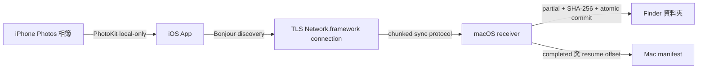

# iPhone Sync

`iPhone Sync` 是一套純區域網路的個人媒體備份工具。使用者在 iPhone 前景手動觸發同步，將一個指定 Photos 相簿中尚未備份、且已存在 iPhone 本機的原始資源，增量傳送至已配對 Mac 的 Finder 資料夾。

## 業務定義 (Business Definition)

- 來源固定為一部 iPhone 上的一個 Photos 相簿。
- 目的地固定為一部已配對 Mac 上的 Finder 資料夾。
- 同步是單向增量備份；iPhone 的刪除不會傳播至 Mac。
- 傳輸只使用同一區域網路，不使用 AirDrop、Bluetooth、Internet relay 或雲端服務。
- 備份保留 PhotoKit 提供的原始 resource bytes，包括 RAW、影片與 Live Photo 組成資源。
- 不在 iPhone 本機的 iCloud Photos resource 會被跳過，不允許自動下載。

## Domain Flow

## MVP 使用方式

1. 在 Mac companion 選擇目的資料夾並開啟兩分鐘配對視窗。
2. 在 iPhone 選擇一個 Photos 相簿及同網路 Mac。
3. 輸入 Mac 顯示的六位數代碼完成長期配對。
4. 在 iPhone 按下 `Sync Now` 並保持 App 在前景。
5. Mac 驗證每個 resource 後寫入 Finder；下次只傳新增內容。

## 專案狀態

設計已核准，App 實作尚未開始。正式規格見 [local album sync design](docs/specs/2026-07-19-local-album-sync-design.md)。
