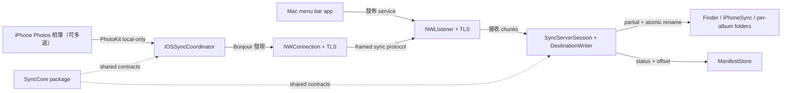
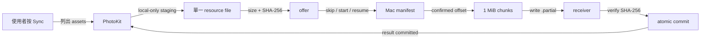

# Local Album Sync Design

Status: `Implemented MVP — live-device acceptance pending`

Date: `2026-07-19`

Feature name: `local-album-sync`

## 1. Goal and Scope

使用者在 iPhone 前景手動按下 `Sync Now`，將一個或多個指定 Photos 相簿中尚未備份、且已存在 iPhone 本機的原始 resources，透過同一區域網路增量傳送至一部已配對 Mac 的 Finder destination；receiver 固定先使用 `iPhoneSync` 容器，每個來源相簿再映射至自己的安全子資料夾。

### Approved Product Decisions

| Concern | Decision |
|---|---|
| Trigger | iPhone 前景手動觸發 |
| Direction | iPhone → Mac 單向增量備份 |
| Deletion | iPhone 刪除永不影響 receiver committed files；default-off post-sync source cleanup 另見 [Delete After Sync 規格](2026-07-27-delete-after-sync.md) |
| Destination | Finder selected folder 下的 `iPhoneSync` + per-album folders，不匯入 macOS Photos |
| Pairing | Mac 顯示六位數，iPhone 輸入 |
| Media | 完整原始 resources，包括 RAW、影片與 Live Photo components |
| Cloud | 禁止 iCloud resource download |
| Network | Bonjour + Network.framework，同一 LAN only |

### Out of Scope

- 背景或自動同步。
- 雙向同步及來源刪除傳播；使用者明確 opt in 的 post-sync source cleanup 是獨立功能，不是 propagation。
- 多部 Mac 或多部 iPhone。
- Internet relay、AirDrop、Bluetooth 或 peer-to-peer fallback。
- 匯入 macOS Photos。
- 已完成原始 resource 的 edit-version tracking。
- 帳號、analytics 或 telemetry。

## 2. System Architecture



### Implemented Repository Placement

```tree
iphone_sync/
├── apps/
│   ├── ios/
│   └── macos/
└── packages/
    └── SyncCore/
```

- `apps/ios`：PhotoKit、multi-album selection、Mac discovery、pairing 與 sender UI。
- `apps/macos`：menu bar receiver、pairing、destination access、error-log panel、manifest 與 Finder writes。
- `packages/SyncCore` 的 `SyncCore` product：wire messages、resource identity、framing、hashing、pairing、Bonjour 與 TLS transport。
- 同一 package 的 `MacReceiverKit` product：SwiftData manifest、destination writer 與 server session。
- 兩個 apps 不互相 import；iOS 只依賴 `SyncCore`，macOS 依賴 `SyncCore` 與 `MacReceiverKit`。
- Package products 不依賴任一 App target；`MacReceiverKit` 只向下依賴 `SyncCore`。

### Component Boundaries

```tree
iOS App
├── IOSAppModel
├── AlbumSelectionStore
├── PhotoLibrarySource
├── IOSSyncCoordinator
└── SwiftUI views

macOS App
├── MacAppModel
├── ReceiverController
├── MacSettingsStore
├── DestinationBookmarkStore
└── SwiftUI menu/setup views

SyncCore
├── contracts、FrameCodec、identity、hashing
├── PairingClient / PairingServer
├── BonjourDiscovery、FramedConnection、TLS parameters
└── SyncClient

MacReceiverKit
├── SourceRecord / AlbumRecord / TransferRecord / ManifestStore
├── DestinationWriter
└── SyncServerSession
```

### Data Ownership

- iPhone 保存多個來源相簿 local identifiers 與 paired Mac PSK identity；舊版單相簿選擇會自動遷移。
- Mac 以 typed `MacSettingsStore` 保存 receiver identity、source binding、destination bookmark bytes 與 launch-at-login intent；paired iPhone PSK identity 保存在 Keychain，album/folder mappings 與 transfer manifest 保存在 SwiftData。
- Mac manifest 是 completed resource 與 confirmed resume offset 的 authoritative source。
- Finder 只保存完成媒體與 app-owned `.partial` 暫存；manifest 留在 Mac App container。

### Mac Persistence Map

| Data | Store | Restart Behavior |
|---|---|---|
| receiver ID、source binding、launch intent | sandbox `UserDefaults` via `MacSettingsStore` | App relaunch 後原值恢復 |
| destination capability | security-scoped bookmark | bootstrap resolve 並重新取得 access |
| paired peer PSK identity | Keychain | first unlock 後可載入 |
| manifest、album mappings、checkpoints | SwiftData `Application Support` | receiver resume 的 authoritative state |
| launch registration | `SMAppService.mainApp` | 使用者登入時啟動 App |
| Setup/status item geometry | AppKit autosave | 下次啟動恢復位置 |

`launchAtLoginRequested` 首次預設為 `true`；使用者關閉後保存 `false`，bootstrap 不得重新開啟。Pairing code、active connection、last summary 與 bounded UI error panel 是 transient runtime state；error detail 只另送 unified logging，不寫入 preferences。

## 3. Local-only Media Extraction

`PhotoLibrarySource` 以 `PHAssetResource.assetResources(for:)` 列出每個 asset 的全部 underlying resources，包括：

- HEIC、JPEG、PNG 與 RAW。
- 原始影片。
- Live Photo photo 與 paired video。
- RAW+JPEG 組合中的所有 resources。
- PhotoKit 提供的 adjustment data 或其他 sidecar resources。

每次只處理一個 resource：

1. 建立 `PHAssetResourceRequestOptions`。
2. 固定設定 `isNetworkAccessAllowed = false`。
3. 以 `PHAssetResourceManager` 寫入單一 staging file。
4. staging 成功後取得 size 並計算 SHA-256。
5. 完成或失敗後清理該 staging file。

相簿使用 `PHFetchResult` 依 index 逐筆取得 asset，不複製完整 asset inventory；每個 staged resource 完成處理與 cleanup 後才取得下一個，因此媒體 bytes 不會整批載入記憶體。

若 resource 只存在 iCloud，PhotoKit 回傳需要 network access 的錯誤；App 將其計入 `skippedNotLocal` 並繼續，不嘗試下載。

## 4. Identity Model

四種 identity 必須分離：

| Identity | Purpose | Owner |
|---|---|---|
| `deviceIdentity` | TLS-PSK identity and paired-peer authentication | iPhone / Mac Keychain |
| `sourceBindingID` | 一個 destination 對應的一部 iPhone backup source set | Mac manifest |
| `resourceID` | logical PhotoKit resource identity | derived in sync session |
| `contentHash` | exact staged bytes integrity | iPhone producer / Mac verifier |

Mac 為目前 destination 保存 `sourceBindingID`，同一 binding 可登錄多個 album IDs；不同 binding 一律拒絕。App 重新安裝或重新配對後，只有使用者明確選擇沿用既有來源時，Mac 才重用該 binding。

```text
resourceID = SHA-256(
    sourceBindingID
    + PHAsset.localIdentifier
    + PHAssetResource.type
    + originalFilename
    + duplicateOrdinal
)
```

`contentHash` 不單獨決定 logical duplication；它用來驗證 bytes、拒絕錯誤續傳，以及在預定 final path 已存在時採納相同內容。不同 `resourceID` 即使具有相同 hash，仍視為不同 Photos resources，避免意外合併使用者刻意保留的重複項目。同一 `resourceID` 若出現在多個已選相簿，manifest 以 `(sourceBindingID, albumID, resourceID)` 產生 album-scoped record key，因此每個對應資料夾都能獨立完成或續傳。

## 5. Discovery and Network Boundary

Mac 以 `NWListener` 發佈 `_iphonesync._tcp` Bonjour service；iPhone 使用 `NWBrowser` 搜尋。

iPhone connection parameters：

- `requiredInterfaceType = .wifi`。
- `includePeerToPeer = false`。
- 不允許 cellular fallback。

Mac 可透過 Wi-Fi 或 Ethernet 加入同一 LAN。若 Bonjour 被 guest-network isolation、VLAN 或 router policy 阻擋，App 回報 Mac unavailable，不繞過該限制。

iPhone `Info.plist` 必須宣告：

- `NSLocalNetworkUsageDescription`。
- `NSBonjourServices` including `_iphonesync._tcp` 與 `_iphonesync-pair._tcp`。
- `NSPhotoLibraryUsageDescription`。

Local Network prompt 只在使用者主動按下 `Find Mac` 後觸發。

## 6. Pairing and Authentication

### Initial Pairing

1. 使用者在 Mac 開啟兩分鐘 pairing window。
2. Mac 同時只接受一個 pairing connection。
3. 雙方透過 temporary plain TCP pairing channel 交換 ephemeral Curve25519 public keys 與 session nonce。該 channel 不傳媒體、PIN、private key 或已配對 secret。
4. 雙方從 shared secret 與完整 handshake transcript 導出相同的 six-digit short authentication string。Transcript 固定包含 protocol version、receiver instance ID、雙方 ephemeral public keys 與雙方 nonces。
5. Mac 顯示代碼；使用者在 iPhone 輸入。
6. iPhone 在本機比較，代碼不經網路傳送。
7. 成功後 iPhone 送出由 shared secret 驗證的 pairing confirmation；Mac 回傳獨立的 server confirmation。
8. 雙方以 HKDF-SHA256 導出 long-term 256-bit PSK 與 opaque PSK identity，並存入 Keychain。
9. Temporary pairing service 關閉；Mac 重新啟動只接受 paired PSK 的 TLS 1.2 listener。

六位數不得作為 encryption key。它只驗證 ephemeral key agreement 未遭中間人替換；PSK 來自完整 ECDH shared secret，不是從六位數反推。

iPhone 在本機累積五次代碼 mismatch 後關閉目前 connection；Mac pairing window 仍受兩分鐘期限限制，但不接受第二個 concurrent connection。PSK identity mismatch 或 key loss 絕不自動降級；使用者必須明確 revoke 並重新配對。

### Subsequent Connections

- iPhone 與 Mac 將 paired 256-bit key 和 opaque identity 加入 `NWProtocolTLS.Options`。
- TLS minimum 與 maximum version 固定為 TLS 1.2，cipher suite 固定為 `TLS_PSK_WITH_AES_128_GCM_SHA256`。Apple 公開 static PSK API 在目前 SDK/runtime 強制 TLS 1.3 會 handshake failure，因此不宣稱或降級自不存在的 TLS 1.3 PSK session。
- PSK 不符時 TLS handshake 直接失敗，App 不建立未加密 fallback。
- TLS handshake 完成後才接受 `session`。

Bonjour TXT record 只包含 protocol version、Mac display name、receiver instance ID 與 pairing availability；不得包含 PIN、公鑰、相簿或 destination 資訊。

## 7. Wire Protocol

### Frame Layout

```text
Fixed Header
├── magic = IPS1
├── protocolVersion
├── messageType
├── requestID
├── payloadLength
└── offset

Payload
├── JSON control metadata
└── raw bytes for chunk
```

Control metadata 使用 Foundation `Codable` JSON；binary chunk 不做 Base64。實作不得加入第三方 serialization dependency。

- Control payload 上限為 64 KiB。
- Chunk payload 上限為 1 MiB。
- Receiver 必須先驗證 declared length，再配置 payload buffer。
- Chunk offset 必須精確等於 manifest 的 confirmed in-session offset；out-of-order 或 overlapping chunk 直接拒絕。

### Message Types

| Message | Direction | Purpose |
|---|---|---|
| `session` | bidirectional | version、identities、單一 album 與 source binding negotiation；多選由 iPhone 依序建立 sessions |
| `offer` | iPhone → Mac | resource descriptor、size、hash 與 dates |
| `decision` | Mac → iPhone | `skip`、`start(offset: 0)` 或 `resume(offset:)` |
| `chunk` | iPhone → Mac | resourceID、offset 與 raw bytes |
| `result` | bidirectional | committed、retryable error 或 rejected |

未知 message、oversized payload、錯誤 offset 或不支援的 protocol version 必須拒絕，不能嘗試猜測相容格式。

## 8. Transfer, Resume, and Commit



- 預設 chunk size 為 1 MiB。
- 每次 send 等待 Network.framework completion，以提供 backpressure。
- Mac 先寫入 `.partial`，每累積 16 MiB synchronize file，再以 transaction 更新 `confirmedOffset`。
- Crash recovery 時，partial 大於 offset 就截斷；小於 offset 就將 manifest 降至實際大小。
- Resume 必須同時符合 album scope、`resourceID`、`contentHash` 與 expected size。
- 完成 SHA-256 驗證後才 atomic rename 並將 manifest 標記 committed。
- iPhone 收到 committed result 後才清理 staging file。
- SHA-256 首次不符時清理 app-owned partial 並完整重傳一次；第二次仍不符就停止 session。

`TransferRecord`：

```text
sourceBindingID
albumID
resourceID              # persisted album-scoped manifest key
logicalResourceID       # wire-level PhotoKit resource identity
contentHash
expectedSize
confirmedOffset
status
finalRelativePath
updatedAt
```

Manifest 使用 SwiftData，保存在 Mac App container。

## 9. Finder Destination

使用者選擇的 Finder folder 是 destination root，Mac 以 security-scoped bookmark 保存權限。每個 session 通過 source/album binding 後，Mac 先建立或重用固定 `iPhoneSync` receiving folder，再建立或重用該 album 的穩定安全子資料夾；所有新的 final 與 partial resource 都寫在該階層內。

```tree
Selected Folder/
└── iPhoneSync/
    ├── Camera Roll/
    │   └── 2025/
    │       └── 12/
    │           ├── IMG_1001__A1B2C3D4.HEIC
    │           └── IMG_1001__A1B2C3D4_paired.MOV
    ├── Family/
    │   └── 2026/
    │       └── 07/
    │           └── IMG_2048__E5F6A7B8.JPG
    └── Family (2)/
        └── 2026/
            └── 07/
                └── IMG_3000__11223344.HEIC
```

檔名格式：

```text
<sanitized-original-stem>__<resourceID prefix>[_resource-role].<original extension>
```

- 預設使用 resourceID 前 8 碼。
- 發生不同內容的 path collision 時延長至 16 碼。
- 一般相簿名稱原樣作為直接子資料夾；空白名稱使用 `Untitled Album`。
- 相簿名稱中的斜線、反斜線與控制字元替換為 `_`，前導 `.` 加上 `_`，阻擋 traversal 與隱藏 path injection。
- `iPhoneSync` 與對應 album 的真實資料夾已存在時，驗證不是 symlink 且仍位於 selected folder 後直接重用，既有內容不刪除；同名項目若是檔案或 symlink，拒絕 session 並記錄 receiver error。
- 不同 album 的安全名稱相同時，第一個使用原名，後續依序使用 `名稱 (2)`、`名稱 (3)`；`AlbumRecord` 保存穩定 mapping，避免跨 session 合併。
- Manifest 的新 `finalRelativePath` 以 Selected Folder 為基準，格式為 `iPhoneSync/<album-folder>/<resource-path>`。
- 舊版尚未完成的 root-level 或 direct per-album `.partial` 在續傳時安全搬入 `iPhoneSync/<album-folder>/`；已 committed 檔案保留其 manifest path，不搬移或刪除。
- Resource filename 仍阻擋 `../`、斜線、控制字元與隱藏 path injection。
- 原始 bytes 不修改。
- commit 後將 Finder creation/modification dates 設成 Photos asset creation date。
- 不建立 XMP 或 JSON sidecar。
- Finder 已有同名且同 hash 的檔案可採納進 manifest；不同 hash 絕不覆寫。
- App 永不刪除 committed destination files。

## 10. State Model

```text
Session
idle
└── discovering
    └── connecting
        └── authenticating
            └── scanning
                └── transferring
                    ├── completed
                    ├── cancelled
                    └── failed

Resource
pending
├── skippedNotLocal
└── staging
    └── offered
        ├── alreadyPresent
        └── transmitting
            └── verifying
                ├── committed
                └── failed
```

每個 album session 回傳固定摘要：新增備份、已存在、不在本機、失敗；iPhone 將已選 albums 的摘要相加後顯示。

## 11. Error Handling

| Error | Behavior |
|---|---|
| Photos permission denied | stop and direct user to Settings |
| Local Network permission denied | stop and direct user to Settings |
| Album missing | stop and require source reset |
| Resource not local | count `skippedNotLocal` and continue |
| iPhone staging space insufficient | fail current resource and stop session |
| Mac unavailable | retry in foreground after 1, 2, and 4 seconds |
| Authentication mismatch | stop immediately; never auto-repair |
| Pairing code wrong | allow at most five attempts in active window |
| Network interruption | preserve partial and resume next connection |
| Mac disk full | stop immediately without retry |
| Destination bookmark stale | stop and show folder picker |
| First integrity mismatch | clear app-owned partial and retry resource once |
| Second integrity mismatch | stop session and report integrity failure |
| Protocol incompatible | reject connection and request App update |

Cancel 或 iOS background transition 會停止排入新 resource，讓目前 resource 的傳送操作安全完成，並保留 Mac confirmed partial。UI 在原同步工作真正結束前不會重新開放 `Sync Now`；再次回到前景後由使用者重新按 Sync。

## 12. User Experience

### iPhone

首次設定依序取得 Photos Full Access、選擇一個或多個相簿、觸發 Local Network prompt、發現 Mac 並完成配對。Limited Photos Access 無法保證完整相簿，因此 App 必須說明並要求 Full Access。

主畫面顯示：

- 已選來源相簿數量或單一相簿名稱。
- paired Mac 與 connection state。
- 上次同步摘要。
- `Sync Now`。
- current album、resource 與 byte progress。
- `Cancel`。

### Mac

Native macOS menu bar companion 顯示 `Ready`、`Pairing`、`Receiving` 或 `Error`。首次設定包含 destination picker、pairing window 與 six-digit display。

設定提供：

- 已配對 iPhone 的顯示名稱與 app-specific device ID；hardware serial number 不在 iOS public API 範圍內，PSK identity 亦不得作為 UI 識別碼。
- 更換 destination folder。
- Forget paired iPhone。
- Reset source binding。
- 使用者選擇是否啟用 `Launch at Login`。
- 最近一次同步摘要。
- 本次執行最近 100 筆 receiver、pairing、destination、bookmark 與 launch-at-login errors；可複製與清除。

使用者可直接增減來源相簿；既有 Finder files 永遠保留，取消選取不會刪除先前備份。

- `Forget paired iPhone` 只撤銷 cryptographic trust，保留 current source binding、album mappings、manifest 與 Finder files；重新配對同一 iPhone 時可沿用 Mac 保存的 current binding。
- `Reset Source` 建立新的 source binding，不刪除舊 manifest 或 Finder files。
- 更換 destination folder 也建立新的 source binding；下次同步會在新 destination 建立 `iPhoneSync` 與每個已選相簿的對應子資料夾，並執行完整的 local-only initial backup，舊 folder 完全不變。

## 13. Privacy and Logging

- 不建立 Internet connection、帳號、analytics 或 telemetry。
- 不使用 AirDrop、Bluetooth 或 Wi-Fi peer-to-peer fallback。
- OSLog 與 Setup error panel 不記錄 PIN、private key、完整檔名或照片 metadata；error panel 為 bounded in-memory state，不跨 App launch 保存。
- Manifest 與暫存檔只留在各自 App container 或使用者指定 destination。

## 14. Testing Strategy

### Unit

- resourceID determinism。
- filename sanitization 與 path traversal rejection。
- frame encode/decode、malformed/truncated/version 與 size limits。
- pairing derivation、proof validation、expiry、Keychain 與 wrong PSK。
- manifest transaction 與 crash reconciliation。
- multi-album scope、duplicate album-name folder allocation、existing-folder reuse 與 legacy single-album record migration。
- SHA-256 verification、integrity single retry 與 second-failure termination。

### Integration

- local `NWListener` / `NWConnection` transfer。
- 16 MiB durable checkpoint recovery and resume。
- truncated、out-of-order 與 oversized frames。
- TLS-PSK mismatch and invalid pairing confirmation proof。
- protocol version mismatch。
- destination same-hash adoption and different-hash non-overwrite。
- multi-album round trip、same-resource cross-album copy、safe album-name sanitization、existing/duplicate folder handling 與 legacy root partial migration。

### Real Devices

- iPhone Wi-Fi → Mac Wi-Fi。
- iPhone Wi-Fi → Mac Ethernet。
- router client isolation and VLAN separation。
- VPN enabled。
- Mac sleep/wake。
- iCloud-only resource with optimized storage。
- RAW+JPEG、Live Photo、duplicate filename 與 large 4K video。

Pairing、Photos permission 與 Local Network permission 必須在實機驗證；Simulator 結果不能代替 live behavior。

## 15. Acceptance Criteria

- 首次配對要求六位數，後續正常同步不再要求。
- 只有持有 paired PSK 的 Mac 能接收該 iPhone 的同步。
- 使用者可選擇一個或多個相簿，Mac 為每個相簿建立或重用對應 folder。
- 未變更的多相簿選擇連續同步兩次時，第二次傳送 0 個 resources。
- 同一 resource 出現在兩個相簿時，兩個對應 folders 都有獨立 committed copy。
- 兩個相簿同名時使用不同且穩定的 folder names；預先存在的 folder 與 files 不刪除、不覆寫。
- 中斷後從最近 durable checkpoint 恢復，而非從 0 開始。
- iCloud-only resource 不觸發下載並計入 `skippedNotLocal`。
- 每個 committed Mac file 的 SHA-256 與 iPhone staged bytes 相同。
- Live Photo 與 RAW+JPEG 的所有 resources 均保存。
- 同名檔案不覆蓋；使用者既有 Finder file 不刪除、不改寫。
- Cancel、iPhone termination 與 Mac crash 不會留下被誤認為 committed 的檔案。
- App 不建立 Internet connection。
- 10,000 assets 可逐筆掃描與傳送，不將完整 inventory 或媒體載入記憶體。
- Mac Setup 可查看與清除最近 100 筆 runtime errors。

## 16. External API References

- [Apple PhotoKit](https://developer.apple.com/documentation/photos)
- [PHAssetResourceRequestOptions network access](https://developer.apple.com/documentation/photos/phassetresourcerequestoptions/isnetworkaccessallowed)
- [Apple Network framework](https://developer.apple.com/documentation/network)
- [Apple local network privacy](https://developer.apple.com/documentation/technotes/tn3179-understanding-local-network-privacy)
- [Apple static TLS pre-shared key API](https://developer.apple.com/documentation/security/2976268-sec_protocol_options_add_pre_sha?changes=la_3)
