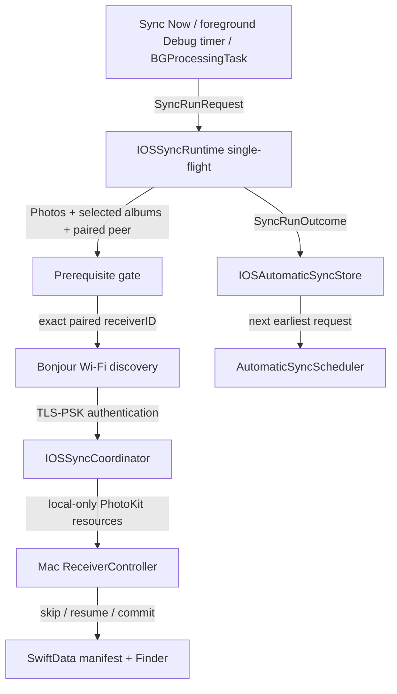

# Automatic LAN Sync

`Status:` Implemented on `2026-07-23`，charging cadence 於 `2026-08-20` 取代 daily schedule；canonical tests/builds/source invariants 已通過，包含 `Release` generic iOS device build。Mac recovery 與 BG adapter 目前只有部分 behavior tests、platform compilation / source-invariant evidence，不是完整 lifecycle behavior tests。Signed physical-device background scheduling 仍須依 [README.todo](../../README.todo) 驗收。

本規格是 `automatic-lan-sync` 的 current behavior。它擴充、但不回寫 [2026-07-19 local album sync design](2026-07-19-local-album-sync-design.md)；後者保留當時 foreground-only MVP 的歷史決策。

## 使用者契約 (User Contract)

完成一次 pairing、授予 Photos Full Access 並選定至少一個相簿後，使用者可：

- 按 `Sync Now` 立即啟動 foreground manual run。
- 開啟 `Automatic Sync`，讓 iOS 在可用時提供 automatic run。
- 關閉 `Automatic Sync` 取消 pending request 與 active automatic run；pairing、相簿選擇、Mac manifest、partial 與 committed Finder files 全部保留。

`Automatic Sync` 預設為 `off`，只有一個 on/off 開關：不提供 interval、指定時間或 SSID allowlist。Cadence 固定為「充電中每 30 分鐘嘗試一次」，power condition 由 `requiresExternalPower` 交給 iOS 判斷，不由 App 讀取電池狀態。`Sync Now` 永遠保留為 background scheduling 不可用、延遲或 Mac 不可達時的 deterministic fallback。

iPhone UI 顯示 opt-in、cadence、`Background App Refresh`、last attempt/success/outcome 與 `Eligible after`。`Eligible after` 只呈現 submitted request 的 earliest date，不得解讀為 guaranteed next run。iPhone `Operation Log` 另記錄 background handler registration、request submission、actual launch、expiration、outcome 與 reschedule operation，屬本次 process 的 bounded diagnostics，不是 durable execution guarantee。

若使用者另行啟用 default-off `Delete After Sync`，system-launched background run 成功後只能保存 fully backed-up pending asset IDs，不得在背景嘗試 Photos library change confirmation。使用者回到 App 後由 foreground destructive action 處理；完整安全條件見 [Delete After Sync 規格](2026-07-27-delete-after-sync.md)。

## 排程契約 (Scheduling Contract)

| Build / trigger | Policy | Contract |
|---|---|---|
| Debug background | `earliestBeginDate = now + 10 minutes`，identifier `com.shuk.iphonesync.ios.scheduled-sync.debug` | iOS 不會更早啟動；可能晚很多，也可能不啟動。 |
| Debug foreground test | App active 時依 persisted `Eligible after` 檢查 | 未到期只等待剩餘時間；回到前景時若已到期便立即用相同 automatic runtime 驗證 flow。 |
| Release 全部 outcome | `earliestBeginDate = now + 30 minutes` + `requiresExternalPower = true`，identifier `com.shuk.iphonesync.ios.scheduled-sync` | 每次 launch 都只是一次嘗試；成功與失敗以相同 interval 重新武裝，沒有每日配額。 |
| Release power gate | `requiresExternalPower = true` | iPhone 未充電時 iOS 不啟動這個 task；沒有 App 端的電池判斷或倒數。 |
| Manual | `Sync Now` | 前景立即嘗試，不受 background scheduler 時機控制。 |

`BGProcessingTask` 是 best-effort system scheduling，不是 cron。`earliestBeginDate` 只限制「不得早於」，actual launch 與 runtime duration 由 iOS 決定。Eligibility 是 relative interval，不是 wall-clock appointment：persisted `Eligible after` 即使已過期也保持原值，重進 App 不得把它往後推。沒有 local day 概念，因此也沒有「今天已完成」這種 deferral。`BGTaskSchedulerPermittedIdentifiers` 必須同時包含 production 與 debug identifier；缺少時 iOS 會以 `BGTaskSchedulerErrorDomain` code `3` 拒絕 submit，scheduler 立即回滾 enabled intent 並 emit error，使用者切換會被視為「沒成功」。Debug scheduler 只在 `#if DEBUG` build 註冊與 reconcile，Release build 不暴露前景 10 分鐘測試迴圈。

Startup 與 scene transition 以 lifecycle edge 為準，不因同一 active/background state 的重複 callback 再 reconcile。Reconcile 會先查詢同 identifier 的 pending request；既有 request 的 eligibility 相同或更早時直接保留，只有新目標更早時才 replacement submit。Debug persisted eligibility 已過期時，App 回到前景會立即執行 foreground test，而不是重新計算 `now + 10 minutes`。Debug lane 維持 `requiresExternalPower = false`，讓 launch path 不必接電源即可驗證。

官方契約：

- [Choosing Background Strategies for Your App](https://developer.apple.com/documentation/backgroundtasks/choosing-background-strategies-for-your-app)
- [BGTaskRequest.earliestBeginDate](https://developer.apple.com/documentation/backgroundtasks/bgtaskrequest/earliestbegindate)
- [Starting and Terminating Tasks During Development](https://developer.apple.com/documentation/backgroundtasks/starting-and-terminating-tasks-during-development)

## 同網路與 Authentication Gate

Automatic run 只有在下列條件同時成立時才傳輸：

1. iPhone connection parameters 要求 `.wifi`，並維持 `includePeerToPeer = false`。
2. `_iphonesync._tcp` Bonjour discovery 找到相容 protocol version 與 exact paired `receiverID`。
3. 使用 Keychain 內已保存的 256-bit PSK 完成 TLS handshake。

這個 gate 不比較 SSID、IP prefix 或 subnet；Mac 可以使用同 LAN Ethernet。`BGProcessingTaskRequest.requiresNetworkConnectivity = true` 只代表 iOS 看見網路，不證明 paired Mac 位於同一 LAN。Guest network、VLAN、VPN、router isolation 或 sleeping/offline Mac 造成 Bonjour / TLS gate 失敗時，run 只保存 outcome 並重新排程，不會連到其他 receiver、自動 pairing、使用 Internet 或降級 plaintext。

## Runtime 與資料流 (Runtime and Data Flow)

| Component | Responsibility |
|---|---|
| `AutomaticSyncPolicy` | Debug 10-minute、Release local-midnight、retry 與 bounded-run policy。 |
| `IOSAutomaticSyncStore` | 保存 enabled intent、last attempt/success/outcome/message 與 next eligible time。 |
| `AutomaticSyncScheduler` | 由 `iPhoneSyncApp.init()` 在 `MainActor` / main queue 註冊 production identifier `com.shuk.iphonesync.ios.scheduled-sync` 與（`#if DEBUG` only）debug identifier `com.shuk.iphonesync.ios.scheduled-sync.debug`，以 pending-request reconcile 與 execution gate 管理 idempotent request、expiration、single completion 與 reschedule。 |
| `IOSSyncRuntime` | Manual / automatic 共用 prerequisite reload、single-flight、run outcome、budget 與 cancellation。 |
| `IOSSyncCoordinator` | 執行 PhotoKit → Bonjour → TLS → wire protocol；automatic 使用 bounded single discovery，manual 保留 foreground retries。 |
| `ReceiverController` | 被動接收、listener retry、pairing-close restore、opening deadline 與 transfer session。 |

每次 automatic run 都重新載入 Photos authorization、相簿選擇與 Keychain paired peer；不依賴 UI bootstrap。它不保存 IP、port、`NWEndpoint`、active connection、resource cursor 或 durable `isRunning`。下一次 run 重新列舉相簿，由 Mac authoritative manifest 對 committed resource 回覆 `skip`，或從 16 MiB durable checkpoint `resume`。

## Concurrency、Cancellation 與 Outcome

- `IOSSyncRuntime` 以 explicit active run ID 保證同一時間只有一個 run。
- Manual run 已執行時，automatic run 回覆 `alreadyRunning`；automatic run active 時 `Sync Now` 不啟動第二條 connection。
- Manual foreground run 在 scene 進入 background 時取消；system-launched run 由 `BGProcessingTask` lifecycle 管理。
- Scheduled run `沒有` application budget：window 長度完全由 iOS 決定，只有 `BGProcessingTask` expiration handler 是上限。Expiration、scene cancellation 或使用者取消會取消 outer operation、in-flight PhotoKit `requestData` staging、Bonjour discovery 與 active `SyncClient`；未交付的 iPhone temporary file 會清理。
- Background launch 撞上進行中的 run 時直接略過該次 launch，並立刻重新排下一個 interval，讓 cadence 不因為被消耗掉的 pending request 而中斷。
- Mac partial 與 manifest checkpoint 保留；後續 run 以既有 resume contract 繼續，不覆寫 committed Finder file。
- Completed / no-changes 會更新 last success；Mac unavailable、network unavailable、needs attention、cancelled 或 internal failure 只更新 attempt/outcome，不偽裝為成功。

`setTaskCompleted(success:)` 描述 handler execution，不代表當日備份一定完成：

| Outcome | BG completion | Reschedule |
|---|---|---|
| completed / no changes | `true` | Debug `+10 minutes`；Release `+30 minutes` |
| Mac / network unavailable、already running | `true` | 同上；沒有獨立的 retry interval |
| prerequisite / pairing needs attention | `true` | 同上，不自動 repair |
| expiration / internal failure | `false` | 同上；未傳完的部分由 receiver checkpoint 續傳 |

## Mac Receiver Reliability

Mac 繼續是 passive receiver，不持有 iPhone schedule 或 outbound auto-connect：

- Normal listener 失敗或 cancelled 時，以 capped exponential backoff 最多重試五次。
- Mac wake 或 network path 從 unsatisfied 恢復為 satisfied 時，強制 reconcile listener。
- Pairing timeout、cancel、open failure 或儲存 pairing 失敗後，若舊 prerequisites 仍有效便恢復 normal listener。
- Incoming connection 必須在 15 秒 opening deadline 內完成 TLS start；逾時會取消並釋放唯一 active slot。
- Receiver 只有在 authentication 完成後才進入 `Receiving`；session cleanup 後回到 `Ready`。

Mac 仍必須醒著、App 已啟動、destination bookmark 有效且 normal listener 可用。Automatic sync 不實作 Wake-on-LAN，也不以 heartbeat 宣稱 iPhone online。

## Capability 與權限邊界

iOS target 宣告：

- `UIBackgroundModes = [processing]`
- `BGTaskSchedulerPermittedIdentifiers = [com.shuk.iphonesync.ios.scheduled-sync, com.shuk.iphonesync.ios.scheduled-sync.debug]`

這兩項是 Info.plist capability declarations，不是 privacy prompt，也不是 sandbox entitlement。Photos Full Access 與 Local Network TCC 仍須在使用者可操作的前景流程先完成；automatic run 不顯示 pairing 或 permission UI。完整清單見 [README.permission.md](../../README.permission.md)。

## 驗證邊界

Canonical `bash scripts/verify.sh` 的 automated evidence 範圍：

- 61 個 Swift package tests 與 39 個 iOS unit tests 通過；
- iOS tests 覆蓋 charging cadence、external-power flag、elapsed eligibility、pending-request idempotence、typed store persistence、runtime prerequisite gate、single-flight、cancellation 與 TLS failure mapping；
- generated plist 含 background processing mode 與 permitted identifier；
- unsigned Mac、generic iOS Simulator 與 `Release` generic iOS device builds 成功；
- generated plist / entitlement / local-only / hard-cancellation / Mac recovery / Operation Log source invariants，以及 tracked、staged、untracked whitespace checks 通過。

Source-invariant checks 只證明程式包含對應 contract；valid-PSK half-open opening deadline 與 server operation event sequence 有 package behavior tests，但 Mac listener retry、wake/path 與 pairing recovery 尚未有完整行為測試。iOS runtime tests 也不等於 `BGProcessingTask` OS launch、expiration、single completion 或 disable race 測試。Signed physical-device / network acceptance 仍需覆蓋 simulated launch/expiration、鎖屏、充電 / 未充電的實際 launch 差異、same/different LAN、Mac Wi-Fi/Ethernet、sleep/wake、listener recovery、large transfer resume 與 overnight natural scheduling。
