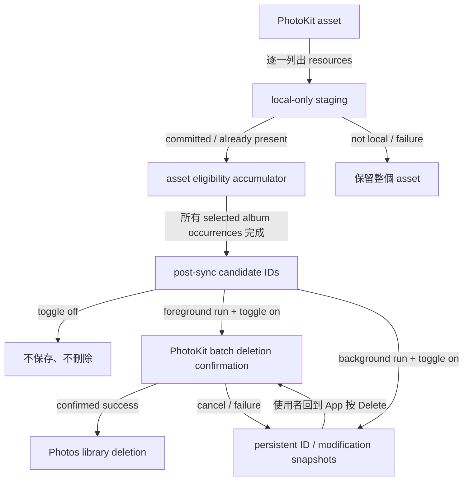

# Delete After Sync 規格

Status: `Implemented — signed physical-device acceptance pending`

Date: `2026-07-27`

Feature name: `delete-after-sync`

## 1. 目標

在 iPhone 主畫面提供預設關閉的 `Delete After Sync` toggle。只有使用者明確啟用，而且某個 Photos asset 的全部本機 original resources 已由已配對 receiver 確認完成時，App 才能請求從 iPhone Photos library 刪除該 asset。

關閉 toggle 時，同步維持純備份行為，不建立待刪項目，也不呼叫任何 PhotoKit deletion API。

## 2. 使用者語意

- `Delete After Sync` 預設關閉並以 `UserDefaults` 保存使用者意圖。
- 啟用前顯示破壞性確認，明確說明刪除的是整個 Photos asset，不是只從所選相簿移除。
- 使用 `iCloud Photos` 時，Photos library deletion 可能同步至同 Apple Account 的其他裝置；確認文案必須直接說明。
- PhotoKit 對 foreground change batch 顯示 system confirmation。使用者拒絕或 change request 失敗時，所有待刪 photos 保留。
- 關閉 toggle、忘記 paired receiver 或清除 pending intent 時，既有待刪 ID 必須移除，之後不得刪除。

## 3. 刪除資格

刪除單位固定為 `PHAsset`，傳輸與完成判定單位仍是 `PHAssetResource`。

一個 asset 只有在下列條件全部成立時才是 candidate：

1. Asset 至少包含一個 PhotoKit resource。
2. 每個 resource 都已存在 iPhone 本機；任何 `PHPhotosError.networkAccessRequired` 都使整個 asset 不具資格。
3. 每個 resource 都收到 receiver 的 `committed` 或 `skip`（authoritative manifest 已有相同 completed resource）。
4. Asset 出現在多個已選相簿時，每個相簿 session 都完成，且每次出現都符合上述條件。
5. 整個多相簿 run 正常完成；任何 session failure、integrity failure、cancel、expiration 或 budget exhaustion 都不得啟動該 run 的 post-sync deletion。
6. 執行刪除前 `Delete After Sync` 仍為 enabled。
7. Candidate 保存的 `PHAsset.modificationDate` 必須與刪除前重新 fetch 的 asset 相同；sync 後被編輯或改 metadata 的 asset 必須保留。

`not local` 是 resource-level summary，但刪除資格是 asset-level AND：Live Photo 的 still image 若已備份、paired video 不在本機，整個 Live Photo 必須保留。

## 4. Runtime Flow

`PhotoLibrarySource.resources(albumID:)` 在每個 asset 的 resource stream 結尾產生 asset-level completion event。`IOSSyncCoordinator` 只在 resource send 全部成功後接收該 event，並以 `PhotoDeletionCandidateAccumulator` 對跨相簿重複 asset 做 AND merge。

`IOSPostSyncDeletionController` 在完整 run 成功後處理 candidates：

- toggle off：立即返回，不寫 pending store。
- foreground manual / debug automatic：先 enqueue，再以一個 `PHPhotoLibrary.performChanges` batch 請求刪除。
- system-launched background automatic：只 enqueue，不在背景嘗試顯示 change confirmation。

## 5. Pending State

| State | Owner | Persistence |
|---|---|---|
| enabled intent | `IOSDeleteAfterSyncStore` | iOS sandbox `UserDefaults` |
| fully backed-up pending asset ID / `modificationDate` snapshots | `IOSDeleteAfterSyncStore` | iOS sandbox `UserDefaults` |
| active PhotoKit deletion request | `IOSPostSyncDeletionController` | transient |
| asset/resource eligibility | `PhotoDeletionCandidateAccumulator` | single sync run only |

Pending ID 只代表某次完整 sync 已確認的 deletion candidate，不是 transfer checkpoint。Mac / Windows manifest 仍是 resource completion 的 authoritative source。

刪除前重新 fetch pending asset；若 ID 已不存在、`modificationDate` 已改變，或 `PHAsset.canPerform(.delete)` 為 false，App 從 pending queue 解析該 candidate、保留 Photos 現況並寫入 warning event，避免誤刪新版本或無限重試。

## 6. 權限

- 保留 `PHPhotoLibrary.requestAuthorization(for: .readWrite)` 與 Full Photos Access requirement。
- 更新 `NSPhotoLibraryUsageDescription`，同時說明 backup 與 optional deletion。
- 不新增 entitlement。
- 不新增 `NSPhotoLibraryAddUsageDescription`；本功能不是 add-only access。
- `isNetworkAccessAllowed = false` invariant 不變。

## 7. UI

主畫面新增 `AFTER SYNC` card：

- toggle off：顯示 `Synced photos stay in your Photos library.`
- toggle on、沒有 pending：顯示只有所有本機 original resources 都確認完成的 photos 才有資格。
- toggle on、有 pending：顯示 pending count 與 `Delete N Synced Photos` destructive button。
- deletion active：顯示等待 Photos confirmation，並停用 toggle、sync 與重複 delete action。

Operation Log 使用 `Delete After Sync` category 記錄 enable / disable、pending、request、success、skip 與 failure；不得寫入 asset local identifier。

## 8. 不變條件

- Receiver committed files 永不因 iPhone deletion 被刪除。
- Wire protocol、`protocolVersion`、resource identity 與 receiver manifest schema 不變。
- `Delete After Sync` 只處理本次或既有 pending 的 fully backed-up assets，不是來源刪除 propagation。
- Automatic background timing仍是 iOS best-effort；pending deletion 必須等待 foreground user confirmation。
- 關閉功能時，所有同步入口（`Sync Now`、Control Center、Shortcuts、automatic run）都不得刪除 Photos assets。

## 9. 驗證邊界

Automated tests 驗證：

- store 預設 disabled、持久化、disable 清 pending。
- 跨相簿 eligibility 使用 AND，不刪 partial / not-local asset。
- 同一 asset 在 sync 中或 pending 後版本改變時失去刪除資格。
- disabled controller 不 queue、不呼叫 deletion service。
- background run queue、foreground action delete。
- PhotoKit deletion failure 保留 pending IDs。
- Simulator / generic device compilation 與 plist source invariants。

Signed physical-device acceptance 仍需驗證：

- system deletion confirmation 的 allow / cancel。
- Live Photo、RAW+JPEG、adjustment-data 與 iCloud-only mixed-resource asset 不被部分刪除。
- `iCloud Photos` 跨裝置 deletion 與 `Recently Deleted` 行為。
- background sync pending 經 relaunch 後的 foreground deletion。
- 大批量 assets、不可刪 asset 與 Photos authorization revocation。
