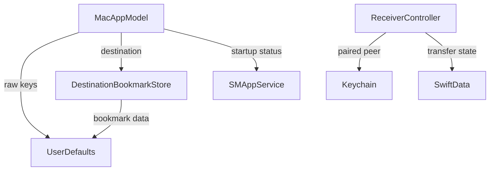
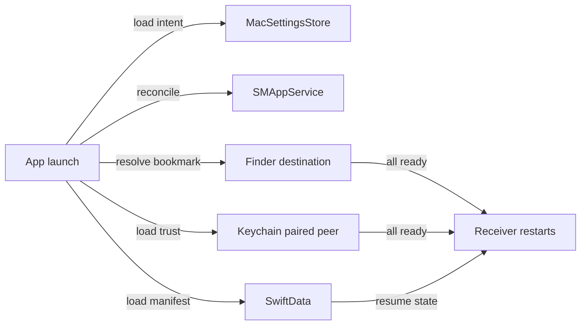

# 架構計畫 — Persistent Mac Settings

`Status:` Implemented and verified on `2026-07-22`；完整 Mac restart acceptance 尚待執行。

## 1. 目標與範圍 (Goal & Scope)

`Feature name:` `persistent-mac-settings`

讓 Mac receiver 的 identity、source binding、Finder destination capability、paired iPhone trust、manifest 與 launch-at-login intent 在 App relaunch 或 Mac restart 後恢復，並自動重新啟動 receiver。

Out of scope：不把 PSK 放入 preferences、不做 iCloud settings sync、不持久化 pairing code、active connection、當次同步 summary 或當次 UI error state。

## 2. 現況架構 (Current Architecture)



目前 durable data 已落在 sandbox container、Keychain 與 macOS login-item registry；缺口是 preferences keys 分散，以及 App 未保存使用者希望 launch at login 的 intent。

## 3. 架構位置與邊界 (Placement & Boundaries)

- `apps/macos/Sources/MacSettingsStore.swift`：唯一擁有非敏感 durable preference keys。
- `DestinationBookmarkStore`：只處理 bookmark encode/resolve，底層資料交由 `MacSettingsStore` 保存。
- `MacAppModel`：協調 startup restore，不直接操作 raw `UserDefaults` keys。
- `ReceiverController`：維持 Keychain 與 SwiftData owner，不依賴 App settings implementation。
- `SMAppService`：維持 launch-at-login authoritative runtime status；`MacSettingsStore` 只保存 requested intent。

依賴方向固定為：

```text
MacAppModel → MacSettingsStore / DestinationBookmarkStore / ReceiverController
DestinationBookmarkStore → MacSettingsStore
ReceiverController → SyncCore + MacReceiverKit
```

## 4. 介面與資料流 (Interfaces & Data Flow)

| Interface | Responsibility |
|---|---|
| `receiverID()` | 取得或建立穩定 Mac receiver identity |
| `sourceBindingID()` / `resetSourceBindingID()` | 保存 destination-scoped backup binding |
| `destinationBookmark` | 保存 security-scoped bookmark bytes |
| `launchAtLoginRequested` | 保存使用者希望重開機後自動執行的 intent |



## 5. 清晰與可擴充性檢查 (Clarity & Scalability Check)

- 單一職責：settings store 不接觸 secrets、manifest 或 runtime network state。
- 依賴方向：App layer 可以依賴 package；package 不反向依賴 App settings。
- 可替換性：`MacSettingsStore` 注入 `UserDefaults`，可用 isolated suite 驗證。
- 擴充點：新增非敏感偏好只需增加 typed property，不散落 raw string keys。
- 安全性：PSK 與 opaque identity 保留在 Keychain，bookmark 保留 security scope。

## 6. 漸進落地步驟 (Incremental Steps)

1. 新增 typed `MacSettingsStore` 並沿用既有 keys，避免 migration 破壞。
2. 將 `MacAppModel` 與 `DestinationBookmarkStore` 改由 settings store 存取。
3. 保存 `launchAtLoginRequested`；首次預設啟用，使用者關閉後永久維持關閉。
4. 保存 Setup window frame，維持重開後的 UI preference。
5. 更新 canonical docs、執行 package/build verification，重啟 App 並比對 durable values 與 login item registration。
