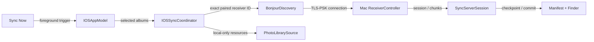
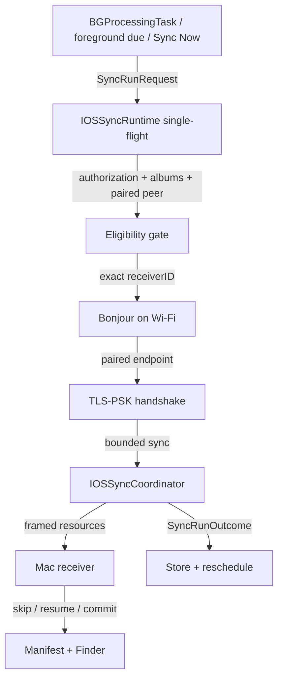

# 架構計畫 — Automatic LAN Sync

`Status:` Implemented on `2026-07-23`；canonical gate 已通過下列 tests/builds/source invariants，包含 `Release` generic iOS device build。Mac recovery 與 BG adapter 目前只具部分 behavior tests、platform compilation / source-invariant evidence，不得視為完整 lifecycle behavior tests。Signed physical-device background scheduling acceptance 仍未完成，此狀態不代表 iOS 會在 requested earliest date 準時啟動。Current behavior 以 [automatic LAN sync spec](../docs/specs/2026-07-23-automatic-lan-sync.md) 為準；本文件保留 pre-implementation reasoning、落地步驟與驗收邊界。

`Feature name:` `automatic-lan-sync`

## 1. 目標與範圍 (Goal & Scope)

已完成一次 pairing、已授予 Photos Full Access、已選來源相簿且 Mac receiver 可用時，iPhone 不需再次選擇 Mac：

1. 到達排程條件後，iPhone 才啟動一次短生命週期的 discovery。
2. Bonjour 只匹配 Keychain 內 paired peer 的 stable `receiverID`。
3. 找到後建立新的 TLS-PSK connection，執行既有增量同步。
4. 完成、失敗或到期後關閉 connection，保存 outcome 並重新安排下一次 request。

`Auto connect` 不代表維持常駐 socket、heartbeat 或保存 IP / `NWEndpoint`。iOS 被 suspend 時無法可靠維持這些狀態；每次 run 都重新 discovery、authenticate、sync、disconnect。

### 排程語意 (Schedule Semantics)

| Build / situation | Request policy | 可承諾行為 |
|---|---|---|
| Debug 測試 | `earliestBeginDate = now + 10 minutes` | Background request 不會早於 10 分鐘；實際啟動可晚很多。App 保持 active 時另用 injected clock 每 10 分鐘觸發，以驗證完整 flow。 |
| Release 正式版 | `earliestBeginDate = next local midnight` | 每個 local calendar day 最多完成一次 automatic run；system 可在午夜後較晚時間才執行。 |
| Manual fallback | 使用者按 `Sync Now` | 前景立即嘗試，不受 background scheduler 時機控制。 |

Apple 對 `earliestBeginDate` 的契約只有「不得更早」，不保證在指定時間啟動；實機 delay 可能達數小時。因此產品文案不得寫成「每 10 分鐘必定同步」或「午夜準時同步」：

- [Choosing Background Strategies for Your App](https://developer.apple.com/documentation/backgroundtasks/choosing-background-strategies-for-your-app)
- [BGTaskRequest.earliestBeginDate](https://developer.apple.com/documentation/backgroundtasks/bgtaskrequest/earliestbegindate)
- [Starting and Terminating Tasks During Development](https://developer.apple.com/documentation/backgroundtasks/starting-and-terminating-tasks-during-development)

### 同網路定義 (Same-network Definition)

Automatic run 必須同時通過：

1. iPhone network parameters 使用 `.wifi` 並維持 `includePeerToPeer = false`。
2. `_iphonesync._tcp` Bonjour 結果包含 exact paired `receiverID` 與相容 protocol version。
3. 使用保存的 256-bit PSK 完成 TLS handshake。

不比較 SSID、IP prefix 或 subnet。Mac 可能透過 Ethernet 接入同一 LAN，SSID 比較會錯誤拒絕；Bonjour metadata 也只是 discovery hint，真正 authentication 仍由 PSK possession 決定。`requiresNetworkConnectivity = true` 只提示 iOS 等到有 network connectivity，不能證明 paired Mac 位於同一 LAN。

### 使用者控制 (User Control)

- 新增單一 `Automatic Sync` switch；既有安裝預設為 `off`，由使用者一次性 opt in。
- 不提供 interval、指定時間、SSID allowlist 或 power condition 等自訂選項。
- Debug 使用 10 分鐘、Release 使用每日 local midnight，均為 internal policy。
- 關閉 switch 時取消 pending request 與 active automatic run；不刪除 paired trust、selected albums、manifest、partial 或 Finder files。
- `Sync Now` 永遠保留為 deterministic fallback。

### Out of Scope

- 精準每 10 分鐘或精準午夜執行。
- 常駐 iPhone connection、Mac heartbeat、Wake-on-LAN 或喚醒 sleeping Mac。
- Internet relay、push server、iCloud download、Bluetooth、AirDrop 或 peer-to-peer fallback。
- 自動 pairing、authentication failure 後自動重新配對，或自動接受另一部 Mac / iPhone。
- 改成 HTTP(S)、background `URLSession` 或 PhotoKit Background Resource Upload。
- iOS 26+ `BGContinuedProcessingTask`；本 feature 維持 iOS 17+，manual run 進入背景後的延續可另立計畫。

## 2. 實作前架構與缺口 (Pre-implementation Architecture and Gaps)



實作前已可直接重用：

- `IOSSyncCoordinator.sync(albums:)` 已從 Keychain 載入 paired peer，依 `peer.id` discovery，並為每個 album 建立新的 TLS-PSK connection。
- `BonjourDiscovery` 已強制 iPhone Wi-Fi、停用 peer-to-peer，並過濾 protocol version。
- Mac bootstrap 已恢復 login item intent、destination bookmark、paired peer、manifest 與 `_iphonesync._tcp` listener。
- Mac manifest 已提供 idempotent `skip`、16 MiB durable checkpoint 與 `resume`，適合中斷後再次執行。

實作前缺口（本次 implementation 已關閉）：

1. iOS 沒有 `BGTaskScheduler`、timer、`UIBackgroundModes` 或 permitted task identifier。
2. `iPhoneSyncApp` 對任何 `scenePhase != .active` 都呼叫 cancellation，無法區分 manual foreground run 與 system-launched background run。
3. `IOSSyncCoordinator` 是 actor，但 `await` 期間仍可 re-enter；目前沒有 explicit single-flight gate。
4. `IOSSyncCoordinator.cancel()` 只設 flag 並停止 discovery，沒有取消 `activeClient`；BG expiration 不能只靠 flag。
5. Scheduled handler 若依賴 `ContentView.task` bootstrap，background launch 時可能沒有完整 prerequisites。
6. Mac listener `.failed` 後不會 retry；sleep/wake 或 transient path failure 後可能不再 advertise。
7. Manual pairing window 會先停止 normal listener，timeout / failure 後沒有恢復 callback。
8. Mac 在 TLS / opening session frame 驗證前就占用唯一 connection slot，且沒有 opening deadline。

## 3. 架構位置與邊界 (Placement & Boundaries)

### iOS App layer

| Placement | Responsibility |
|---|---|
| `apps/ios/Sources/AutomaticSyncPolicy.swift` | 純 schedule policy、local-midnight calculation、Debug 10-minute cadence、retry window 與 injected clock。不得 import `BackgroundTasks` 或 Network framework。 |
| `apps/ios/Sources/IOSAutomaticSyncStore.swift` | Typed `UserDefaults` owner；保存 enabled intent、last attempt/success/outcome 與 next requested earliest date。不得保存 endpoint、active run 或 transfer offset。 |
| `apps/ios/Sources/IOSSyncRuntime.swift` | Manual / automatic 的唯一 execution owner；載入目前 Photos authorization、selected albums、paired peer，實作 single-flight、budget 與 run outcome。 |
| `apps/ios/Sources/AutomaticSyncScheduler.swift` | `BGTaskScheduler` adapter；由 `iPhoneSyncApp.init()` 在 `MainActor` / main queue register exactly once，並以 execution gate 管理 expiration、single completion 與 resubmit。 |
| `apps/ios/Sources/IOSAppModel.swift` | UI adapter；顯示 enablement、last outcome、background availability 與 manual progress，不擁有 schedule calculation。 |
| `apps/ios/Sources/iPhoneSyncApp.swift` | Composition root；在 app launch 結束前註冊 handler，注入同一個 runtime 給 UI 與 scheduler。 |
| `apps/ios/Sources/IOSSyncCoordinator.swift` | 保留 PhotoKit → Bonjour → TLS → wire protocol pipeline；補上 active-client cancellation，PhotoKit staging 以 cancellable `requestData` hard stop。 |

Scheduling 是 iOS application concern，不放進 `SyncCore`。`SyncCore` 維持 transport、wire contract、identity 與 crypto；Mac receiver 不反向依賴 iOS schedule policy。

### macOS App layer

| Placement | Responsibility |
|---|---|
| `apps/macos/Sources/ReceiverController.swift` | Listener restart/backoff、opening-session deadline、pairing close callback；仍為 passive receiver，不新增 timer 或 outbound sync。 |
| `apps/macos/Sources/MacAppModel.swift` | 在 bootstrap、wake、path recovery 與 pairing 結束後 reconcile receiver prerequisites。 |

Automatic flow 絕不開啟 `_iphonesync-pair._tcp`。Paired peer 缺失或 PSK authentication failure 時，run 回報 `needsUserAction`，只能由使用者在前景重新 pairing。

依賴方向固定為：

```text
iPhoneSyncApp
├── IOSAppModel ───────────────┐
└── AutomaticSyncScheduler ────┴──→ IOSSyncRuntime
                                      └──→ IOSSyncCoordinator
                                              └──→ SyncCore

MacAppModel → ReceiverController → SyncCore + MacReceiverKit
```

## 4. 介面與資料流 (Interfaces & Data Flow)

### 核心合約 (Core Contracts)

跨模組合約限制為四個：

| Contract | Purpose |
|---|---|
| `AutomaticSyncPolicy.nextRequestDate(after:lastSuccess:reason:)` | 以 injected `Calendar` 計算 Debug 10-minute、Release local-midnight 或 retry request。 |
| `AutomaticSyncScheduler` | 在 main queue register、submit/cancel request、處理 expiration 與 single completion；OS launch 本身只在 signed 實機驗收。 |
| `IOSSyncRuntime.run(_ request: SyncRunRequest) async -> SyncRunOutcome` | 共用 manual / automatic pipeline、prerequisite gate、single-flight 與 bounded batch。 |
| `IOSSyncRuntime.cancel(runID:) async` | 取消 outer task、Bonjour discovery、PhotoKit stream 與 `activeClient`，等待 cleanup 後回傳。 |

建議 value types：

```swift
enum SyncTrigger: Sendable {
    case manualForeground
    case automaticForeground
    case automaticBackground
}

struct SyncRunRequest: Sendable {
    let id: UUID
    let trigger: SyncTrigger
    let maximumElapsed: Duration?
}

enum SyncRunOutcome: Sendable {
    case completed(SyncSummary)
    case noChanges(SyncSummary)
    case deferred(DeferredReason)
    case budgetExhausted
    case cancelled
    case failed(SyncFailure)
}
```

Scheduled run 使用 `maximumElapsed = 8 minutes`；manual run 不設 application budget。Budget、scene cancellation 或 iOS expiration 會 hard-cancel in-flight PhotoKit `requestData`、Bonjour discovery、outer operation 與 active client，並清理未交付的 staging file。Mac 已收到的 partial 仍以既有 checkpoint 保留，後續 run 可 resume。

初版不保存 iOS asset cursor。下一次從相簿開頭列舉，由 Mac manifest 對已完成 resource 回覆 `skip`；這是正確且可回滾的 baseline。實機 profiling 證明大型 library 的重掃成本不可接受後，才另設 cursor design，不能把 PhotoKit fetch index 當 durable identity。

### Automatic Run Data Flow



### Lifecycle

1. `iPhoneSyncApp.init()` 在 launch sequence 內，以 `MainActor` / main queue 為 identifier `com.bizshuk.iphonesync.ios.scheduled-sync` register exactly once。
2. 使用者開啟 `Automatic Sync` 後提交唯一 pending `BGProcessingTaskRequest`：
   - `requiresNetworkConnectivity = true`
   - `requiresExternalPower = false`
   - Debug earliest = `now + 10 minutes`
   - Release earliest = next local midnight
   - lifecycle restore 先查詢同 identifier 的 pending request；相同或更早的 request 保留，只有新目標更早時才 replacement submit
   - Debug persisted eligibility 即使已到期仍保留，避免 App re-entry 再延後 10 分鐘
3. Handler 一開始先安排保底的下一次 request，再建立 `SyncRunRequest(.automaticBackground)`。
4. Runtime 重新讀取 Photos authorization、selected album IDs 與 Keychain peer，不依賴 UI bootstrap。
5. 若符合 prerequisites，Bonjour 只等待 paired receiver；scheduled run 不使用 manual 的多輪 39 秒 discovery retry，單次 bounded discovery 失敗就 defer。
6. Handler 設定 expiration callback；expiration 以 run ID 取消 outer task、PhotoKit staging、discovery 與 active client。
7. Main-actor execution gate 等待 runtime cleanup，確保 handler 只呼叫一次 `setTaskCompleted(success:)`，保存 outcome，再依 outcome replacement schedule。

`setTaskCompleted(success:)` 描述 handler execution，而不是「今天一定完成備份」：

| Outcome | BG completion | Next request |
|---|---|---|
| `completed` / `noChanges` | `true` | Debug +10 minutes；Release next local midnight |
| Mac not visible / network interrupted / already running | `true` | Debug +10 minutes；Release +1 hour，直到當日成功 |
| Photos permission / albums / paired peer missing | `true` | 顯示 `Needs Attention`；每日低頻 recheck，不自動 repair |
| budget exhausted | `false` | Debug +10 minutes；Release +1 hour |
| expiration / internal runtime failure | `false` | 保存 diagnostic，提交 bounded retry |
| PSK / protocol / source binding rejected | `true` | 停止短期 retry，要求使用者處理 |

Release 的「一天一次」以 `lastSuccessAt >= startOfToday` 判定，不以 request submit time 判定。Timezone 或 DST 改變後使用 `Calendar.autoupdatingCurrent` 重新計算；同一 local day 已成功時，晚到或重複 handler 只 reschedule，不再傳輸。

### Scene and Concurrency Rules

- `scenePhase == .inactive` 不再視為一律 cancellation。
- 相同 `.active` 或 `.background` state 的重複 callback 不產生第二次 transition 或 reconcile。
- `.manualForeground` / `.automaticForeground` 在 scene 進入 `.background` 時取消；`.automaticBackground` 由 `BGProcessingTask` lifecycle 管理，不因 scene 非 active 自行取消。
- Runtime 有 explicit `activeRunID`；actor isolation 本身不足以阻止 `await` reentrancy。
- Manual run 已執行時，scheduled run 回覆 `deferred(.alreadyRunning)`；scheduled run 已執行時，`Sync Now` 暫時 disabled，不啟動第二條 connection。
- Durable store 不保存 `isRunning`；process crash 後由 Mac checkpoint 與新 run 自然恢復。

### Mac Receiver Availability

在 automatic sync 上線前，Mac 需完成三個 P0 reliability gates：

1. Listener `.failed` 以 capped backoff 重新 bind / advertise，並於 Mac wake 或 network path recovery 立即 reconcile。
2. Pairing timeout、cancel 或 failure 後，若舊 paired peer 與 destination 仍有效，自動恢復 normal listener。
3. 未 authentication 的 connection 必須有 TLS / opening-session deadline；逾時釋放唯一 active slot。`Receiving` 與 `lastAuthenticatedAt` 只能在 session accepted 後更新。

Mac 不持有 schedule intent、next due date 或 phone-online state。它只顯示 receiver health、last authenticated connection、last completed session 與 error。

## 5. 清晰與可擴充性檢查 (Clarity & Scalability Check)

| Check | Result |
|---|---|
| 單一職責 | Policy 算日期、scheduler 封裝 OS、runtime 執行 run、coordinator 傳輸、Mac 被動接收。 |
| 依賴方向 | iOS schedule 不進 `SyncCore`；Mac 不依賴 iOS app；package 不反向依賴 app target。 |
| 安全性 | 只連 exact paired ID，PSK 才是 authentication；不自動 pairing、不保存 endpoint、不降級 plaintext。 |
| Local-only | Wi-Fi + Bonjour + existing Network.framework transport；維持 `isNetworkAccessAllowed = false`。 |
| 可中斷性 | 每個 run bounded；expiration 可 hard-cancel PhotoKit staging、discovery 與 active client；Mac manifest 繼續 authoritative resume。 |
| 冪等性 | 重複 task、晚到 task、crash recovery 都由 `lastSuccessAt` gate 與 Mac `skip/resume` 保持安全。 |
| 可測試性 | Policy 的 `Calendar` 與 runtime environment 可注入；BG adapter 由 plist/build invariants 驗證，system launch 留給 signed 實機。 |
| 可替換性 | 未來可替換 schedule policy，不改 wire protocol、manifest 或 Finder layout。 |

不引入的複雜度：

- 不建立長連線 manager 或 heartbeat protocol。
- 不建立新的 server、push、account 或 cloud state。
- 不將 BGTask types 滲入 `SyncCore`。
- 不以 SSID、IP 或 Bonjour TXT 當 authentication。
- 不建立使用者可調 schedule options。

## 6. 漸進落地步驟 (Incremental Steps)

### Step 1 — Pure policy、store 與 tests (`Implemented`)

- 新增 `AutomaticSyncPolicy`、`IOSAutomaticSyncStore` 與 injected clock/calendar。
- 在 `project.yml` 新增 `iPhoneSyncIOSTests` target。
- 覆蓋 10-minute cadence、elapsed eligibility、foreground remaining delay、next local midnight、DST、timezone change、same-day coalescing、retry 與 disabled state。
- Rollback：移除新檔與 test target；runtime 行為不變。

### Step 2 — Shared single-flight runtime (`Implemented`)

- 新增 `IOSSyncRuntime`，讓 `Sync Now` 先改走同一入口。
- 將 prerequisite reload、explicit active run ID、typed outcome、application budget 與 hard cancellation 放入 runtime。
- 修正 cancellation，使 outer task、discovery、PhotoKit staging stream 與 `activeClient.cancel()` 全部完成 cleanup。
- 驗證 manual flow 與現有 summary 不變。
- Rollback：IOSAppModel 切回直接呼叫 coordinator；wire protocol 不變。

### Step 3 — Mac receiver reliability gates (`Implemented`)

- 加入 listener supervisor、wake/path reconcile、pairing-close restore 與 unauthenticated opening deadline。
- Canonical gate 以 package behavior test 覆蓋 valid-PSK half-open timeout 與後續 slot recovery，並檢查 retry/wake source invariants、編譯 unsigned Mac target；listener failure、sleep/wake、pairing expiry 與完整 `Ready` recovery matrix 尚未有 behavior tests。
- Rollback：保留原 bootstrap，移除 supervisor；不修改 manifest schema。

### Step 4 — BGProcessingTask adapter (`Implemented`)

- 在 `project.yml` canonical source 加入：
  - `UIBackgroundModes: [processing]`
  - `BGTaskSchedulerPermittedIdentifiers: [com.bizshuk.iphonesync.ios.scheduled-sync]`
- App launch 早期 register handler，加入 schedule/coalesce/expiration/completion。
- Lifecycle reconcile 查詢 pending request 並保留相同或更早的 eligibility；Debug re-entry 不重複 submit、不把已到期 request 往後推。
- 更新 `scripts/verify.sh` 檢查 generated plist 與 identifier。
- iOS tests 涵蓋 pending-request reconcile、single-flight / cancellation；BG adapter 的 OS launch、expiration、single completion 與 disable race 仍須 signed-device lifecycle acceptance。
- Rollback：取消 pending request、關閉 automatic toggle、移除 plist declarations；manual flow 保留。

### Step 5 — UI、diagnostics 與 current docs (`Implemented`; durable contact telemetry deferred)

- iPhone 加入單一 `Automatic Sync` switch、background availability、last attempt/success/outcome 與「system scheduled, timing not guaranteed」說明。
- Mac 此次完成 receiver recovery；後續 [Operation Log Panels](2026-07-23-operation-log-panels.md) 已加入兩端 bounded runtime timeline。`last authenticated contact` / `last completed session` 的 durable telemetry 仍 deferred；不顯示虛假的 next run。
- 更新 `README.md`、`CLAUDE.md`、`apps/ios/README.md`、`README.permission.md`、permission skill reference 與 `README.todo`。
- 新增 dated approved spec；保留 `2026-07-19` historical spec 的 foreground-only 決策不回寫。
- Rollback：隱藏 toggle 並取消 request；保留 diagnostic code 不影響 manual sync。

### Step 6 — Signed physical-device acceptance (`Pending`)

- 使用 signed iPhone / Mac 驗證 Photos、Local Network、Keychain、Mac bookmark 與 login item。
- Debug active-app test：跨至少三個 10-minute windows，確認每次只建立一個 run。
- Background test：在實體裝置透過 Xcode debugger simulate launch 與 expiration；私有 debug selector 不寫入 shipping code。
- Network matrix：same-LAN Wi-Fi→Wi-Fi、Wi-Fi→Ethernet、different LAN、VPN、router isolation、Mac sleep/wake、listener restart。
- Transfer matrix：no changes、new photo、large video、network interruption、expiration、resume、disk full、authentication mismatch。
- Overnight soak：記錄 request earliest、actual launch、Mac visibility、outcome 與 next request，證明 best-effort 行為，不以準時午夜作 pass condition。

Acceptance criteria：

- 已配對且同 LAN 時，system 真正啟動 handler 後不需使用者點擊即可完成 authentication 與增量 sync。
- Mac 不可見或不在同 LAN 時不連其他 receiver、不觸發 pairing、不使用 Internet，並安全 reschedule。
- 任一時間最多一個 run；重複 handler 不重複 commit 或覆寫 Finder files。
- Expiration 會取消 active client，Mac partial 與 manifest checkpoint 可由後續 run resume。
- Release 同一 local day 最多完成一次 automatic run；午夜只是 earliest target，不是準時保證。
- Background scheduling 完全不可用時，UI 明確顯示狀態且 `Sync Now` 仍可工作。
