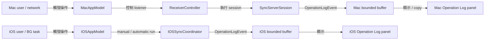
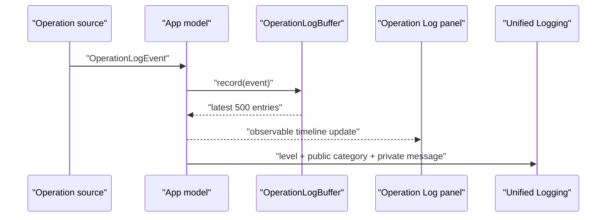

# Operation Log Panels

`Status:` Implemented on `2026-07-23`

## 1. 目標與範圍 (Goal and Scope)

在 iPhone sender 與 Mac receiver 提供同一套可讀的 `Operation Log` panel，讓使用者能追蹤 App lifecycle、設定、Photos 授權、相簿選擇、配對、Bonjour discovery、listener recovery、manual / automatic sync、session、resource 與 error 操作。

範圍限制：

- 每筆事件使用 `info`、`success`、`warning` 或 `error` level，以及 category、時間與使用者可讀訊息。
- 每個 App process 保留最新 `500` 筆，並把相同事件送至 Apple Unified Logging。
- 記錄 semantic operation boundary，不逐一記錄每個 1 MiB chunk 或 protocol frame；resource progress 仍由既有 progress UI 顯示。
- Panel 不記錄 PSK、SAS pairing code、cryptographic identity、source binding、content hash 或完整 destination root。
- Album 名稱、resource filename 與 Mac 回覆的 destination-relative path 是使用者可見的操作內容。
- 不新增 log database、cloud upload、remote telemetry 或跨 App 共用 mutable state。

## 2. 現況架構 (Current Architecture)



## 3. 架構位置與邊界 (Placement and Boundaries)

| Layer | Responsibility |
|---|---|
| `SyncCore` | 定義 `OperationLogEvent`、`OperationLogEntry`、level 與 bounded buffer；不依賴 UI |
| `apps/ios` | 產生 sender / scheduler 操作事件、持有 observable entries、顯示 iOS panel |
| `MacReceiverKit` | 由 `SyncServerSession` 回報 album session 與 resource lifecycle |
| `apps/macos` | 產生 receiver / menu / settings 操作事件、持有 observable entries、顯示與複製 Mac panel |
| Apple Unified Logging | 接收兩端同一批事件；category 公開、message 使用 private privacy |

依賴方向維持：

```text
apps/ios ───────────────→ SyncCore
apps/macos ─────────────→ SyncCore + MacReceiverKit
MacReceiverKit ─────────→ SyncCore
```

## 4. 介面與資料流 (Interfaces and Data Flow)

| Interface | Contract |
|---|---|
| `OperationLogBuffer.record(_:)` | newest-first insert，超過 capacity 時移除最舊 entries |
| `IOSSyncCoordinator.onOperation` | 依序回報 discovery、pairing、album、session 與 resource event |
| `AutomaticSyncScheduler.onOperation` | 回報 registration、schedule、launch、expiration 與 outcome |
| `SyncServerSession.run(onEvent:)` | 回報 session open/accept/complete 與 resource offer/start/resume/skip/commit/fail |
| `ReceiverController.onOperation` | 回報 pairing、listener、retry、connection 與轉送 server event |



## 5. 清晰與可擴充性檢查 (Clarity and Scalability Check)

- `OperationLogBuffer` 只處理順序與容量，不知道 App、UI 或 protocol。
- iOS 與 macOS models 各自擁有 timeline，不建立跨 App storage 或反向依賴。
- `SyncServerSession` event callback 有 default `nil`，既有 caller 不需要產生 UI dependency。
- 新 operation source 只需送出 `OperationLogEvent`，不需修改 buffer 或 panel data model。
- Resource level 事件可診斷每個檔案；chunk level telemetry 被刻意排除，避免大型媒體造成無法閱讀的 log flood。

## 6. 漸進落地步驟 (Incremental Steps)

1. 加入共用 event / entry / bounded buffer 與 capacity tests。
2. 由 `SyncServerSession` 回報 server session / resource events，加入 loopback sequence test。
3. 接入 iOS coordinator、automatic scheduler 與 `IOSAppModel`。
4. 將 Mac `Error Log` 擴充為 receiver 全操作 timeline，接入 menu、settings、listener 與 server events。
5. 建立兩端 `Operation Log` UI、Mac `Copy All` 與兩端 clear action。
6. 更新 canonical docs、Xcode project 與 verification invariants。
7. 執行 package tests、iOS unit tests、Mac / Simulator / Release device builds 與 whitespace gate。
